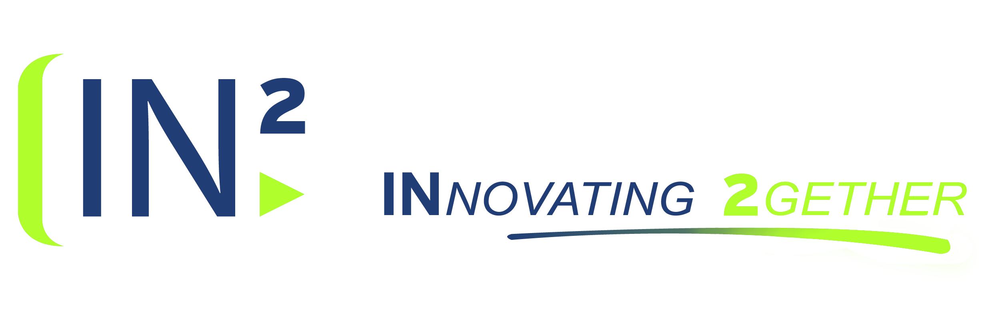

# Desmos Guide

Desmos Guide is a documentation which implements all the needed info to implement our Desmos component as a solution.

## Table of Contents
<!-- TOC -->
- [Desmos Guide](#desmos-guide)
  - [Table of Contents](#table-of-contents)
  - [Introduction](#introduction)
  - [Prerequisites](#prerequisites)
  - [Installation](#installation)
    - [Docker Compose Setup](#docker-compose-setup)
  - [Running the Component](#running-the-component)
  - [DESMOS Marketplace: How to Publish New Services](#desmos-marketplace-how-to-publish-new-services)
  - [Troubleshooting](#troubleshooting)
<!-- /TOC -->

## Introduction

DESMOS serves as a crucial component within the Access Node architecture, facilitating interaction between off-chain storage and on-chain storage. This RESTful API exposes a set of endpoints designed for seamless communication between the Context Broker and Blockchain.

## Prerequisites

Docker: Users will need Docker installed on their system to build and run containerized applications. Docker Compose will be used for defining and running multi-container Docker applications. Users can download Docker from the official Docker website.

## Installation

### Docker Compose Setup

To install both the component and its dependencies, it will be necessary to compose at least the containers for these components. Additionally, this guide will cover all the environment variables that make up these components to enable their configuration.

```yaml
# Blockchain Connector
desmos:
  image: in2kizuna/desmos:v1.0.0-SNAPSHOT
  environment:
    - SPRING_R2DBC_URL=r2dbc:postgresql://postgres:5432/mktdb
    - SPRING_R2DBC_USERNAME=postgres
    - SPRING_R2DBC_PASSWORD=postgres
    - SPRING_FLYWAY_URL=jdbc:postgresql://postgres:5432/mktdb
    - LOGGING_LEVEL_ES_IN2_DESMOS=DEBUG
    - OPENAPI_SERVER_URL=https://localhost:9091
    - OPENAPI_SERVER_DESCRIPTION=Blockchain Connector Test Server
    - OPENAPI_INFO_TITLE=Blockchain Connector
    - OPENAPI_INFO_DESCRIPTION=Blockchain Connector Component
    - OPENAPI_INFO_VERSION=1.0.0-SNAPSHOT
    - OPENAPI_INFO_TERMS_OF_SERVICE=https://example.com/terms
    - OPENAPI_INFO_LICENSE_NAME=Apache 2.0
    - OPENAPI_INFO_LICENSE_URL=https://www.apache.org/licenses/LICENSE-2.0.html
    - OPENAPI_INFO_CONTACT_NAME=IN2, Ingeniería de la Información
    - OPENAPI_INFO_CONTACT_URL=https://in2.es
    - OPENAPI_INFO_CONTACT_EMAIL=contacto@in2.es
    - CLIENT_ORGANIZATIONID=VATFR-00869734
    - BLOCKCHAIN_ADAPTER_INTERNAL_DOMAIN=http://blockchain-adapter:8080
    - BLOCKCHAIN_ADAPTER_EXTERNAL_DOMAIN=http://blockchain-adapter:8080
    - BLOCKCHAIN_ADAPTER_PROVIDER=digitelts
    - DLT_ADAPTER_PATHS_CONFIGURE_NODE= /api/v1/configureNode
    - DLT_ADAPTER_PATHS_PUBLISH= /api/v1/publishEvent
    - DLT_ADAPTER_PATHS_SUBSCRIBE=/api/v1/subscribe
    - DLT_ADAPTER_PATHS_EVENTS= /api/v1/events
    - BLOCKCHAIN_RPC_ADDRESS=https://red-t.alastria.io/v0/9461d9f4292b41230527d57ee90652a6
    - BLOCKCHAIN_USER_ETHEREUM_ADDRESS=0xb794f5ea0ba39494ce839613fffba74279579268
    - BLOCKCHAIN_SUBSCRIPTION_ACTIVE=true
    - BLOCKCHAIN_SUBSCRIPTION_NOTIFICATION_ENDPOINT=http://blockchain-connector:8080/notifications/dlt
    - BLOCKCHAIN_SUBSCRIPTION_EVENT_TYPES=ProductOffering,ProductOrder
    - BROKER_PROVIDER=scorpio
    - BROKER_EXTERNAL_DOMAIN=http://scorpio:9090
    - BROKER_INTERNAL_DOMAIN=http://scorpio:9090
    - NGSI_SUBSCRIPTION_NOTIFICATION_ENDPOINT=http://blockchain-connector:8080/notifications/broker
    - NGSI_SUBSCRIPTION_ENTITY_TYPES=ProductOffering,ProductOrder
  ports:
    - "9091:8080"
  depends_on:
    - blockchain-adapter
    - postgres
 ```

SPRING_R2DBC_URL: Specifies  the URL for  the R2DBC (Reactive Relational  Database  Connectivity) database  connection. In this case, it  points  to a PostgreSQL database  named  mktdb  hosted  on  the  postgres  service.

SPRING_R2DBC_USERNAME: The  username  for  accessing  the R2DBC database. Here, it's set to  postgres.

SPRING_R2DBC_PASSWORD: The  password  for  the R2DBC database  access. In this  configuration, it's  postgres.

SPRING_FLYWAY_URL: Designates  the JDBC URL for  Flyway  migrations, allowing  the  application  to  manage  database  schema  evolution. It  points  to  the  same PostgreSQL database as the R2DBC URL.

LOGGING_LEVEL_ES_IN2_DESMOS: Defines the  logging  level  for  the  application. DEBUG is  used  here  for  detailed  logging output.

OPENAPI_*: These variables configure the  OpenAPI  documentation, specifying  the server URL, description, title, version, terms  of  service, license  information, and contact  details  of  the API.

CLIENT_ORGANIZATIONID: Represents  the  organization ID of  the  client, used  for  identifying  the  client  within  the  blockchain  network.

BLOCKCHAIN_ADAPTER_*: Configuration  for  the  blockchain  adapter, including  internal and external  domains, provider, and API paths  for  node  configuration, event  publishing, subscription, and event  retrieval.

BLOCKCHAIN_RPC_ADDRESS: The URL for  the  blockchain RPC (Remote Procedure  Call) server, allowing  the  application  to  interact  with a blockchain  network.

BLOCKCHAIN_USER_ETHEREUM_ADDRESS: Specifies  the Ethereum address  of  the  user, used  for  transactions and interactions  within  the  blockchain  network.

BLOCKCHAIN_SUBSCRIPTION_ACTIVE: A flag  indicating  whether  blockchain  event  subscriptions are active. Set to true to  enable.

BLOCKCHAIN_SUBSCRIPTION_NOTIFICATION_ENDPOINT: The  endpoint  where  blockchain  notifications  will be sent.

EVENT_SUBSCRIPTION_NOTIFICATION_ENDPOINT: Specifies  the  endpoint  for  event  subscription  notifications.

EVENT_SUBSCRIPTION_ENTITY_TYPES: Defines the  types  of  entities  for  which  events are subscribed.

BROKER_PROVIDER: Indicates  the  broker  service  provider, such as Scorpio.

BROKER_EXTERNAL_DOMAIN and BROKER_INTERNAL_DOMAIN: Specify  the  external and internal  domains  of  the  broker  service, respectively.

NGSI_SUBSCRIPTION_NOTIFICATION_ENDPOINT: The  endpoint  for NGSI (Next Generation  Service Interfaces) subscription  notifications.

NGSI_SUBSCRIPTION_ENTITY_TYPES: Lists  the  entity  types  for NGSI subscriptions.

The  Context  Broker  component, we  will use Scorpio.

## Running the Component

To deploy the Blockchain Connector along with its dependencies detailed in the Docker Compose configuration, execute the command:

```bash
docker-compose up -d
```

This command runs the containers in detached mode, allowing the containers to run in the background.

## DESMOS Marketplace: How to Publish New Services


DESMOS employs  an  initialization  process  for  the  marketplace  that  retrieves  entities  every time it  starts. This  means  that  even  when  the  processing  queue  is  blocked, users can still  publish  their  services  to  the  component  while  it  is  initializing. Once the  queue  is  unblocked, these  services  will be processed  accordingly.

To  persist new services, users  should  make POST, PATCH, or DELETE requests  to  their  Context  Broker. In the  context  of  this  usage guide, our  Context  Broker  is  accessible at http://localhost:9094.

After a service  is  persisted, users  should observe confirmation logs in their DESMOS instance  indicating  successful  publication  of  the  entity. These logs serve as an  acknowledgment  that  the  entity has been  successfully  published and is  now  part  of  the  marketplace, ready  for  interaction and engagement  within  the DESMOS ecosystem.

Furthermore, it's  important  for  users  to  persist  entities  following  the NGSI-v2 format. Entities  should be structured in a manner similar to  the  example  provided  below. This  ensures  compatibility  with  the DESMOS system and allows  for  seamless  integration and interaction  within  the  marketplace.

Here is  an  example  format  for  persisting  entities:

```json
{
  "id": "urn:ngsi-ld:PointOfInterest:RZ:MainSquare",
  "type": "PointOfInterest",
  "category": {
    "type": "Property",
    "value": ["113"]
  },
  "description": {
    "type": "Property",
    "value": "Beach of RZ"
  },
  "location": {
    "type": "GeoProperty",
    "value": {
      "type": "Point",
      "coordinates": [-8, 44]
    }
  },
  "@context": [
    "https://schema.lab.fiware.org/ld/context",
    "https://uri.etsi.org/ngsi-ld/v1/ngsi-ld-core-context.jsonld"
  ]
}
```

## Troubleshooting

Finally, it's  important  to note that in the  event  of  an  unexpected shutdown or error in DESMOS, the  system  is  designed  for  resilience. Upon  restart, DESMOS will  automatically  recover  all  entities  that  may  have  been  pending in the  shared catalogue or  within  the  user's  context  broker. This  feature  ensures  that no data is  lost and that  the  marketplace can continue to  operate  smoothly, even after unforeseen  disruptions.

This  automatic  recovery  process  is  part  of  DESMOS's  commitment  to  providing a robust and reliable  service, ensuring  users can confidently  manage  their  services  without  concern  for data loss  due  to  system  errors  or  shutdowns. By  leveraging  the  resilience  features  of DESMOS, users can focus  on  enhancing and expanding  their  service  offerings  within  the  marketplace, knowing  their data integrity  is  safeguarded.
