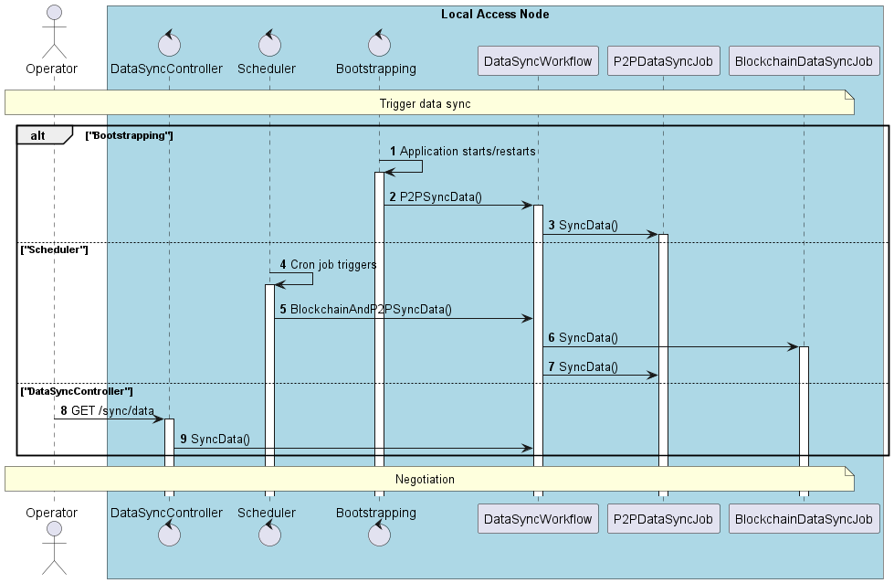
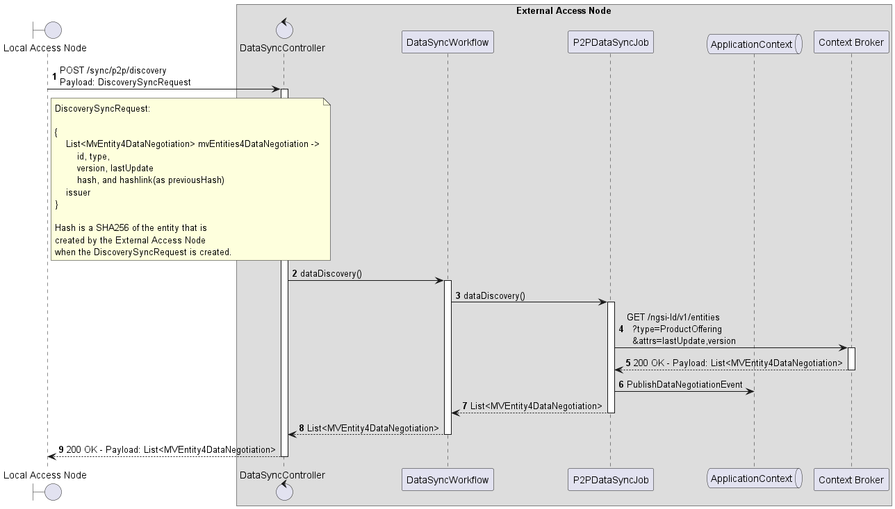
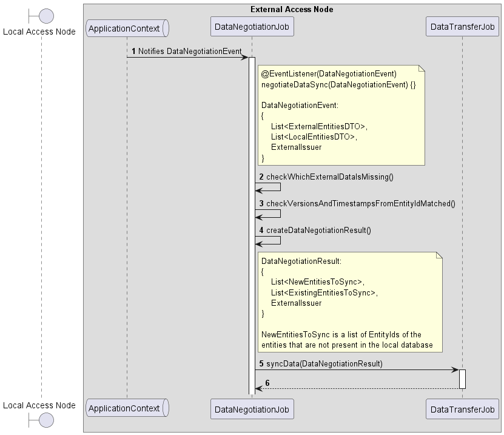

<h1>Desmos: Blockchain Connector Technical Document— <i>Draft 1</i></h1>

<h2>Table of Contents</h2>
<!-- TOC -->
* [Introduction](#introduction)
* [Abbreviations and Acronyms](#abbreviations-and-acronyms)
* [Key Features](#key-features)
* [Constraints and Assumptions](#constraints-and-assumptions)
* [Container View](#container-view)
* [Use Cases](#use-cases)
  * [Use Case 1 — Initial Subscriptions Setup](#use-case-1--initial-subscriptions-setup)
    * [1. Triggering Initial Subscriptions Setup](#1-triggering-initial-subscriptions-setup)
    * [2. Subscriptions Setup](#2-subscriptions-setup)
      * [2.1 Broker Subscription](#21-broker-subscription)
      * [2.2 DLT Subscription](#22-dlt-subscription)
  * [Use Case 2 — Data Synchronization](#use-case-2--data-synchronization)
    * [1. Triggering Data Synchronization](#1-triggering-data-synchronization)
    * [2. Discovery](#2-discovery)
    * [3. Synchronization](#3-synchronization)
    * [4. Completion](#4-completion)
  * [Use Case 3 — Publisher: Create and publish data to the blockchain](#use-case-3--publisher-create-and-publish-data-to-the-blockchain)
    * [1. Receiving the Broker Notification](#1-receiving-the-broker-notification)
    * [2. Building the data object to be published](#2-building-the-data-object-to-be-published)
    * [3. Publishing the data object to the Blockchain](#3-publishing-the-data-object-to-the-blockchain)
  * [Use Case 4 — Subscribe: Retrieve and publish data to the context broker](#use-case-4--subscribe-retrieve-and-publish-data-to-the-context-broker)
    * [1. Receiving the DLT Notification](#1-receiving-the-dlt-notification)
    * [2. Retrieving Entities](#2-retrieving-entities)
    * [3. Publishing Entities to the Context Broker](#3-publishing-entities-to-the-context-broker)
* [Blockchain Connector Auditory](#blockchain-connector-auditory)
* [Data Model](#data-model)
  * [Broker Notification](#broker-notification)
  * [DLT Notification](#dlt-notification)
  * [Entity](#entity)
  * [Entity Data Pointer](#entity-data-pointer)
  * [AggregatedTxPayload](#aggregatedtxpayload)
  * [Audit Record](#audit-record-)
* [Desmos Configurations Map](#desmos-configurations-map)
* [Resources](#resources)
<!-- TOC -->


<div style="page-break-before: always;"></div>

# Introduction

Desmos is a comercial name for a Blockchain Connector solution. It is responsible for publishing and retrieving all change-events for the Participant from the Blockchain.

To do that, the Blockchain Connector is able to integrate with its local Context Broker and the Blockchain Adapter/API to federate data through the blockchain network robustly and securely.

Furthermore, Blockchain Connector interacts with external Context Brokers that are part of the same federation to retrieve data from these external sources, making possible the data federation through the participants.

The events that are published are not the local stored entities, but the minimum data required to guarantee the retrieval of the original entity from the source. This is achieved by the use of the [cryptographic hyperlinks](https://w3c-ccg.github.io/hashlink/), also known as hashlink, and metadata attributes.


<div style="page-break-before: always;"></div>

# Abbreviations and Acronyms

[//]: # (TODO: Define all the abbreviations and acronyms)

| Abbreviation/Acronym | Full name                     |
|----------------------|-------------------------------|
| DLT                  | Distributed Ledger Technology |
|                      |                               |


<div style="page-break-before: always;"></div>

# Key Features

The Blockchain Connector is able to:

* Listen for change-events from the local broker and the blockchain network through subscriptions.

* Receive notifications from the local broker and the blockchain network.

* Build entity data pointers from the local broker entities and send to the blockchain network for publication.

* Resolve entity data pointers, retrieve the actual entity from their source, and write them to the local Context Broker.

* Audit any process executed by the Blockchain Connector and write them to a local database.


<div style="page-break-before: always;"></div>

# Constraints and Assumptions

- The Blockchain Connector creates a subscription to the local Context Broker entities types by configuration parameters. 

> NOTE: It is the operator's responsibility to ensure that entity types configured MUST exist in the business model of the local Context Broker.


- The Blockchain Connector creates a subscription to the DLT Adapter/API event types by configuration parameters.

> NOTE: It is the operator's responsibility to ensure that event types configured MUST exist in the business model of the ecosystem.


- All entities stored in the local Context Broker that match the subscription MUST be processed by the Blockchain Connector.

> NOTE: It is not Blockchain Connector's responsibility to add any type of filtering criteria to the entities received. This responsibility is part of the application layer.  


- The Blockchain Connector MUST retrieve the entities from the Context Broker without using any batch retrieval mechanism.

> TODO: The Context Broker does not have a retrieval mechanism for entities and its relationships with a single request. Define the batch retrieval mechanism of the entities and its relationships from the Context Broker.


- The Blockchain Connector MUST resolve the entities from the Context Broker and write them to the blockchain network.

> It is not Blockchain Connector's responsibility to assert that entities and possible relationships are written to the local Context Broker. This responsibility is part of the application layer. Nevertheless, the Blockchain Connector MAY provide a mechanisms to retrieve the entities and its relationships from the blockchain network if the application layer detects that an entity or related entity is missing.


- The Blockchain Connector MUST implement a buffering mechanism to aggregate several entity data points in a single transaction and send them to the blockchain network.

> NOTE: The buffering mechanism is used to reduce the weight of the transaction and the number of transactions sent to the blockchain network. It can be triggered by the number of entities in the queue or the time passed since the last transaction was sent. The number of the entities is calculated by the average size per transaction, i.e., 1–2 kb per transaction.


- Any entity MUST have a hashlink to ensure that entity has not been tampered with.


- When the Blockchain Connector is set for the first time, it MUST retrieve all transactions that match with the set preferences from the Blockchain network. Then, it starts a process of resolving and writing them to the local Context Broker, that is called `Data Synchronization Process`.


- The Blockchain Connector MUST audit any process done by the Blockchain Connector and write them to a local database.


- Any record of the local database has a hash to ensure that the record has not been tampered with. It is built from the hash of the row, and the hash of the previous row guaranteeing the integrity of the records.


- The Blockchain Connector MUST block the publication or retrieval of any entity during the data synchronization process.

> NOTE: This process guarantees the data consistency of the local Context Broker.


- The Blockchain Connector CANNOT write a new entity retrieved from the blockchain network to the local Context Broker if any of the entities related to or the main entity have been tempered with.


- The Blockchain Connector CANNOT write a new entity retrieved from the blockchain network to the local Context Broker if the previous version of the entity is still missing to be written to the local Context Broker. This guarantees the data consistency of the local Context Broker.


- The Blockchain Connector's Data Synchronization Process MUST be able to be initiated by an operator of an Access Node instance, or be initiated by a program (e.g., Cron), in addition to automatically on start/restart.


- To ensure the data consistency of the local Context Broker, the Blockchain Connector MUST be able to synchronize the data with other Access Nodes of the ecosystem. That is, the Blockchain Connector MUST have configured at least one Access Node of the ecosystem to synchronize the data.

> NOTE: At least one of the Blockchain Nodes configured MUST be the DOME Operator Access Node. The pointers to the Access Nodes are configured in the Access Node configuration.


<div style="page-break-before: always;"></div>

# Container View

The Blockchain Connector has *relations* with the local Context Broker, the Blockchain Adapter/API, the local database, and the other Context Brokers of the federation.


<div style="page-break-before: always;"></div>

# Use Cases

The Blockchain Connector has different use cases: 

1. **Initial Subscriptions Setup**

    The application configures and establishes the necessary subscriptions to entities in the context broker and the DLT upon application startup. 
    It ensures that the application is prepared to receive notifications and act upon them in accordance with defined workflows.
    
    > NOTE: This process also activates the Data Synchronization Process.

2. **Data Synchronization**

   If the application starts/restart, or if the operator wants to sync its data, the Blockchain Connector starts a process to sync data. This process ensures that the data stored in the local Context Broker is the same as the data stored in the trust source of DOME.

3. **Publish: Create and Publish Data to the Blockchain**

    The application receives an entity change-state notification stored in a context broker. 
    The application's mission is to create an `entity_data_point` and publish this information on a configured DLT.

4. **Subscribe: Retrieve and Publish Entity**

    The application receives a notification from the DLT, analyzes the data, and uses the information to retrieve the entity from its source.
    Once retrieved and validated, the application writes/publishes it in its local context broker.


<div style="page-break-before: always;"></div>

## Use Case 1 — Initial Subscriptions Setup

The following steps define the process of the Initial Subscriptions Setup:


### 1. Triggering Initial Subscriptions Setup

The service starts and listens for `ApplicationReadyEvent.class`.

### 2. Subscriptions Setup

In parallel, the service creates a `broker_subscription` based on the configuration parameters for local Context Broker entity types and a `dlt_subscription` based on the configuration parameters for DLT Adapter/API event types.

#### 2.1 Broker Subscription


This is a non-normative example of a BrokerSubscriptionRequest:

```plaintext
POST /ngsi-ld/v1/subscriptions HTTP/1.1
Host: scorpio.example.com
Content-Type: application/json

{
  "id": "urn:ngsi-ld:Subscription:9daa1f2a-8141-4b39-b592-732acc607bd7",
  "type": "Subscription",
  "entities": [
    {
      "type": "ProductOffering"
    },
    {
      "type": "ProductSpecification"
    },
    {
      "type": "ProductOfferingPrice"
    }
  ],
  "notification": {
    "endpoint": {
      "uri": "https://desmos.example.com/notifications/broker",
      "accept": "application/json",
      "receiverInfo": [
        {
          "Content-Type": "application/json"
        }
      ]
    }
  }
}
```

This is a non-normative example of a BrokerSubscriptionResponse:

```plaintext
HTTP/1.1 201 Created
Content-Type: application/json
Cache-Control: no-store
```

#### 2.2 DLT Subscription


This is a non-normative example of a DLTSubscriptionRequest:

```plaintext
POST /api/v1/subscribe HTTP/1.1
Host: dlt.example.com
Content-Type: application/json

{
  "eventTypes": [
    "ProductOffering",
    "ProductSpecification",
    "ProductOfferingPrice"
  ],
  "notificationEndpoint": "https://desmos.example.com/notifications/dlt"
}
```

This is a non-normative example of a DLTSubscriptionResponse:

```plaintext
HTTP/1.1 201 Created
Content-Type: application/json
Cache-Control: no-store
```

If both subscriptions are successfully created, the service can proceed to the data synchronization process (see next use case).


<div style="page-break-before: always;"></div>

## Use Case 2 — Data Synchronization

This is a proposal to solve the DOME Data Synchronization process.
We will assume that the source of truth is the catalog with all their information, not the blockchain.

### 1.Introduction

Desmos offers two ways to synchronize entities:

* **Blockchain connection**: The access node retrieves all data from the blockchain using the blockchain connector.
* **P2PDataSyncJob**: The local access node retrieves entities from configured external access nodes, among which one
  need to be the DOME Marketplace node.

### 2. Data Synchronization Process

#### 2.1. Triggering Data Synchronization



The Data Synchronization process can be triggered in three ways:

* **Start/Restart**: Upon an application start or restart, an event (`ApplicationReadyEvent.class`) triggers the Data
  Synchronization process. P2PDataSyncJob will be used as synchronization way to prevent
  Blockchain connection synchronization from slowing down the start of the application.


* **Operator**: An operator can manually initiate the Data Synchronization process by sending a GET request
  to `/sync/data`.

> NOTE: It hasn't yet been decided which synchronization method will use the operator trigger.


* **Scheduled Task**: A Cron job is set up to automatically trigger the Data Synchronization process at a specific time,
  for example, at 2:00 AM daily. The synchronization will be done using both blockchain connection and P2PDataSyncJob.

#### 2.2. P2PDataSyncJob

##### 2.2.1. Peer Discovery
Multiple known nodes must be configured, but at least one needs to be the DOME Marketplace node.
> TODO: Every node needs to discover other nodes which are eligible to synchronize.
> Peer discover can be done in a centralized way (P2P Hybrid) -> Trust Framework

##### 2.2.2. Set Connection
> TODO: Try to set direct connection. (Need to negotiate communication protocols, exchange keys to verify the identity of
> the node, etc.)

##### 2.2.3. Data Negotiation
###### 2.2.3.1 Local access node

The goal of the Data Negotiation process is to make our entities known to the external access nodes and obtain a list of
data of the entities of each external access node.

The process begins with a discovery step where it sends a GET request to /ngsi-ld/v1/entities/ with a query parameter.

The query parameter helps to retrieve the list of local minimum viable entities for data negotiation, that are stored in
the local Context Broker,
not the full entity data.

This is a non-normative example of a `EntitiesDiscoveryRequest` and `EntitiesDiscoveryResponse`:

```plaintext
GET /ngsi-ld/v1/entities/ HTTP/1.1
Host: context-broker.org
Content-Type: application/json
```

```plaintext
HTTP/1.1 200 OK
Content-Type: application/json
Cache-Control: no-store

[
    {
        "id": "urn:ProductOffering:d86735a6-0faa-463d-a872-00b97affa1cb",
        "type": "ProductOffering",
        "version": "v1.2",
        "lastUpdate": "2024-04-01T12:00:00Z"
    },
    {
        "id": "urn:ProductOffering:ed9c56c8-a5ab-42cc-bc62-0fca69a30c87",
        "type": "ProductOffering",
        "version": "v5.4",
        "lastUpdate": "2024-02-24T12:00:00Z"
    }
]
```

Upon receiving a 200 OK response,
the Blockchain Connector posts the list of local minimum viable entities for data negotiation to every of the configured Access Nodes.

This is a non-normative example of a `SyncDiscoveryRequest`:

```plaintext
POST /sync/discovery HTTP/1.1
Host: <configured-access-node>
Content-Type: application/json
Authorization: <bearer_access_token>
    
{
  "issuer" : "https://my-domain.org",
  "external_entity_ids" : [
    { 
      "id" : "urn:ProductOffering:d86735a6-0faa-463d-a872-00b97affa1cb",
      "type": "ProductOffering",
      "version": "v1.2",
      "lastUpdate": "2024-04-01T12:00:00Z",
      "hash: "89e62d6be87fd39dc19dc69a35d58d1ac2351854bf48a8264bf075643c89eddf",
      "hashlink: "8ce0461d10e02556d3f16e21c8ac662c037f8b39efd059186b070f9aad8c00f0"
    },
    { 
      "id" : "urn:ProductOffering:ed9c56c8-a5ab-42cc-bc62-0fca69a30c87",
      "type": "ProductOffering",
      "version": "v5.4",
      "lastUpdate": "2024-02-24T12:00:00Z",      
      "hash: "08b236983ba01bbcd268793b104917f89f0bba8160d2f693911087c72b9a8051",
      "hashlink: "8bc17b3e9f6e3d54e3f5b63e4a8826a28bba7d03d0f46c7a79b1f4d13eb4ee2f"
    }
  ]
}
```

> NOTE: The IAM grants the permissions to start a synchronization process at the top of the Access Node.
> The requester
> MUST be a registered DOME Participant to start a synchronization process and get the list of external entity IDs.
> This
> endpoint is not public.

If the Access Node is available,
and the Participant has the permissions,
it sends a 202 Accepted response with a payload containing their minimum viable entities for data negotiation list.

SyncDiscoveryResponse:

```plaintext
HTTP/1.1 202 ACCEPTED
Content-Type: application/json
Cache-Control: no-store

{
  "issuer": "https://<configured-access-node>.org",
  "external_entity_ids": [
    { 
      "id" : "urn:ProductOffering:537e1ee3-0556-4fff-875f-e55bb97e7ab0",
      "type": "ProductOffering",
      "version": "v9.2",
      "lastUpdate": "2023-10-05T12:00:00Z"
    },
    { 
      "id" : "urn:ProductOffering:ed9c56c8-a5ab-42cc-bc62-0fca69a30c87",
      "type": "ProductOffering",
      "version": "v5.4",
      "lastUpdate": "2024-02-24T12:00:00Z" 
    }
  ]
}
```

###### 2.2.3.2 External access node

In the Data Negotiation, the External Access Node, receives a POST request to /sync/p2p/discovery, with the
minimum viable entities for data negotiation.

Then, the External Access Node sends a GET request to /ngsi-ld/v1/entities/ with a query parameter.

The query parameter helps to retrieve the list of local minimum viable entities for data negotiation, that are stored in
the local Context Broker,
not the full entity data.

This is a non-normative example of a `EntitiesDiscoveryRequest` and `EntitiesDiscoveryResponse`:

```plaintext
GET /ngsi-ld/v1/entities/ HTTP/1.1
Host: context-broker.org
Content-Type: application/json
```

```plaintext
HTTP/1.1 200 OK
Content-Type: application/json
Cache-Control: no-store

[
    {
        "id": "urn:ProductOffering:d86735a6-0faa-463d-a872-00b97affa1cb",
        "type": "ProductOffering",
        "version": "v1.2",
        "lastUpdate": "2024-04-01T12:00:00Z"
    },
    {
        "id": "urn:ProductOffering:ed9c56c8-a5ab-42cc-bc62-0fca69a30c87",
        "type": "ProductOffering",
        "version": "v5.4",
        "lastUpdate": "2024-02-24T12:00:00Z"
    }
]
```

Upon receiving a 200 OK response, the Access Node publishes an event with the received data, and return a 200 OK with the received data.

###### 2.2.3.1 Data Negotiation Event

DataNegotiationJob listens for a DataNegotiationEvent, when it receives it compares the local and external lists to find any differing entities.
The entities of the external list that are missing in the local list or have a newer version or timestamp will be candidates for synchronization through the Access Node.
It sends the DataNegotiationResult with the new entities and the existing entities to the DataTransferJob.

##### 2.2.3. Data Transfer
###### 2.2.3.1 Local access node

When the system has both lists, it compares the local and external lists to find any differing entities.
The entities of the external list
that are missing in the local list will be candidates for synchronization through the Access Node.

The Local Access Node request each access node their missing and outdated entities.

This is a non-normative example of an EntitySyncRequest:

```plaintext
POST /sync/entities HTTP/1.1
Host: <configured-access-node>
Content-Type: application/json
Authorization: <bearer_access_token>
    
[
  {"id" : "urn:ProductOffering:537e1ee3-0556-4fff-875f-e55bb97e7ab0"}
]
```

> NOTE: The IAM grants the permissions to start a synchronization process at the top of the Access Node.
> The requester needs to have permissions to retrieve the requested entities from the Access Node.

> TODO: How the IAM knows if the requester has permissions to retrieve not only the entity whether the entity's
> relationships from the Access Node?

The configured Access Node processes the request and retrieves the entity, ProductOffering, and the entity's
relationships from the local Context Broker.
Then, it creates a response with the detailed data requested.

This is a non-normative example of a `EntitySyncResponse` with the detailed data requested:

```plaintext
HTTP/1.1 202 ACCEPTED
Content-Type: application/json
Cache-Control: no-store

[
  {
    "id": "urn:ProductOffering:537e1ee3-0556-4fff-875f-e55bb97e7ab0",
    "type": "ProductOffering",
    "version": "v9.2",
    "lastUpdate": "2023-10-05T12:00:00Z"
    "productSpecification": {
      "id": "spec-broadband-001",
      "name": "1Gbps Broadband Spec"
    },
    "productOfferingPrice": {
      "type": "Relationship",
      "object": "urn:ProductOfferingPrice:912efae1-7ff6-4838-89f3-cfedfdfa1c5a"
    }
  },
  {
    "id": "urn:ProductOfferingPrice:912efae1-7ff6-4838-89f3-cfedfdfa1c5a",
    "type": "ProductOfferingPrice",    
    "version": "v2.1",
    "lastUpdate": "2023-10-09T12:00:00Z"
    "name": "Monthly Subscription Fee",
    "priceType": "recurring",
    "price": {
      "amount": "49.99",
      "currency": "USD"
    },
    "recurringChargePeriod": "monthly"
  }
]
```

The response contains the entity ProductOffering and the entity's relationships ProductOfferingPrice in a same response.

> TODO: In this scenario, we cannot guarantee the integrity of the entity's relationships.
> We need to define a mechanism to ensure the integrity of the entity's relationships,
> such as the entity's relationships hash.
>
> This is not happening within the current pub-sub mechanism through the blockchain because we implement a hashlink to
> ensure the integrity of the entity.

The local Blockchain Connector processes the response, that means, before publishing any entity, it checks if the entity
exists in the local Context Broker.

It sends a POST request to upsert the missing and outdated entities in the Context Broker.

If one or more entities are created it receives a 201 Created response.

If only entities are updated it receives a 204 No Content response.

> NOTE: Bear in mind that all entities processed by the Blockchain Connector have their own audit records, although they
> are not explained in this diagram.

###### 2.2.3.2 External access node

In the Data Transfer, the External Access Node, receives a DataNegotiationResult with the new entities to sync, the
existing entities to sync and the external issuer.

The access node, request the entities to the issuer and receive it.

> TODO: Nodes can implement data segmentation to optimize the transfer specially with networks with high latency or low connection velocity.
Then it

Then, the External Access Node sends a GET request to /ngsi-ld/v1/entities/ with a query parameter.

The query parameter helps to retrieve the list of local minimum viable entities for data negotiation, that are stored in
the local Context Broker,
not the full entity data.

This is a non-normative example of a `EntitiesDiscoveryRequest` and `EntitiesDiscoveryResponse`:

```plaintext
GET /ngsi-ld/v1/entities/ HTTP/1.1
Host: context-broker.org
Content-Type: application/json
```

```plaintext
HTTP/1.1 200 OK
Content-Type: application/json
Cache-Control: no-store

[
    {
        "id": "urn:ProductOffering:d86735a6-0faa-463d-a872-00b97affa1cb",
        "type": "ProductOffering",
        "version": "v1.2",
        "lastUpdate": "2024-04-01T12:00:00Z"
    },
    {
        "id": "urn:ProductOffering:ed9c56c8-a5ab-42cc-bc62-0fca69a30c87",
        "type": "ProductOffering",
        "version": "v5.4",
        "lastUpdate": "2024-02-24T12:00:00Z"
    }
]
```

Upon receiving a 200 OK response, the Access Node publishes an event with the received data, and return a 200 OK with the received data.


### 4. Completion


Once the synchronization is complete, the system marks the process as done.


<div style="page-break-before: always;"></div>

## Use Case 3 — Publisher: Create and publish data to the blockchain

The Producer Workflow is responsible for publishing the change-events from the local Context Broker to the blockchain network. It listens for change-events from the local broker through subscriptions, builds entity data points, and requests for writing them to the blockchain network.


### 1. Receiving the Broker Notification

1. Receive the notification from the Context Broker.
2. Process the notification.
    1. Create audit record — status = RECEIVED.
    2. Check the validity of the notification.
        1. If the notification is valid, then:
            1. Prioritize the notification.
            2. Enqueue the notification.
        2. else:
            1. Discard the notification.


The Blockchain Connector listens for notifications from the local Context Broker. 

This is a non-normative example of a BrokerNotification:

```plaintext
POST /notifications/broker HTTP/1.1
Host: desmos.example.com
Content-Type: application/json

{
  "id": "urn:notification:123",
  "type": "ProductOffering",
  "data": [
    {
      "id": "urn:ProductOffering:123",
      "name": "1Gbps Broadband"
    }
  ],
  "subscriptionId": "urn:subscription:123",
  "notifiedAt": "2023-03-20T12:34:56Z"
}
```

When a notification is received, the Blockchain Connector processes the notification and creates an audit record with status RECEIVED.

Then, it checks the validity of the notification. If the notification is valid, it prioritizes the notification and enqueues it. Otherwise, it discards the notification.

> DOUBT: Is it better to create an audit record until the notification is validated? Or is it better to create an audit record after the notification is validated?


### 2. Building the data object to be published

1. Get the notification from the queue. 
2. Map the notification to capture the entity's data. 
3. Validate the entity's data.
    1. If the entity's data is valid, then:
        1. Create an entity data point with the data provided by the entity.
        2. Create audit record — status = CREATED.
        3. Enqueue the event.
    2. else:
        1. Store entity's data in the local database to be retried later.


The Blockchain Connector works with queues to manage the application flow. The `PublisherService` listens for notifications from the queue. When a new event is enqueued, the service processes the event to build a new data object which will be published on the blockchain network.

The `EntityDataPoint` is a data object created to share the minimum data required to retrieve the original entity from the source. It contains the following attributes:

[//]: # (TODO: Define all the steps to build an EntityDataPoint)

To build the `EntityDataPoint`, the Blockchain Connector follows the next steps:

1. Build a new `EntityDataPoint`.
2. Request to the DB, the last `audit_record` persisted whose `entity_id` equals `Entity.entityId`.
3. If the `AuditRecord` exists, then:
    1. Get the `entityHash` from the `AuditRecord`.
    2. Set the this `AuditRecord.entityHash` as `EntityDataPoint.previousHash`.
4. else:
    1. Set the `EntityDataPoint.previousHash` with a default value `0x0000...0000`.
5. Create a new hash with the entity's data.
6. Set the new hash in the `EntityDataPoint.entityHash`.
7. Build a new hash with the previous hash and the new entity's data hash.
8. Set the `EntityDataPoint.dataLocation` attribute with the resulting hash.

This is a non-normative example of an EntityDataPoint:

```json
{
  "eventType": "ProductOffering",
  "iss": "0x8dyl...68da8s",
  "entityId": "0x0fyt...m1d9fr",
  "previousEntityHash": "0x6r1f...sd5u7b",
  "dataLocation": "https://cb.example.com/ngsi-ld/v1/entities/urn:ProductOffering:123?hl=0x7ff6...m1rh4r",
  "relevantMetadata": [
    "0x5of6...m13sur"
  ]
}
```

When the `EntityDataPoint` is built, the Blockchain Connector creates an audit record with status CREATED and enqueues the event to the publishing queue.


### 3. Publishing the data object to the Blockchain

1. If there are 10 events in the queue or 10 seconds have passed, then:
    1. Create an AggregateEvent with the events in the queue.
    2. Send the AggregatedEvent to be published in the node.
    3. If the event is successfully published, then:
        1. Create audit record — status = PUBLISHED.
    4. else:
        1. Get the event and store it in the local database to be retried later.


To publish the events, we have decided to implement a Buffering mechanism. The Buffering mechanism is responsible for aggregating the events in a single transaction and sending them to the blockchain network.

The Buffering mechanism is triggered when the number of events in the queue reaches a certain threshold or when a certain amount of time has passed since the last event was enqueued.

> NOTE: To reduce the weight of the transaction, the events aggregated to the single transaction MAY be compressed encoding the events in GZIP, but we need to consider the responsibility of the decompression and filtering of the events in the blockchain network. 

[//]: # (TODO: Define the responsibility of the decompression and filtering of the events in the blockchain network)

This is a non-normative example of an AggregatedEvent:

```json
{
  "entity_data_pointer_list": [
    {
      "iss": "0x8dyl...68da8s",
      "entityType": "ProductOffering",
      "entityId": "0x0fyt...m1d9fr",
      "previousEntityHash": "0x6r1f...sd5u7b",
      "dataLocation": "https://cb.example.com/ngsi-ld/v1/entities/urn:ProductOffering:123?hl=0x7ff6...m1rh4r",
      "relevantMetadata": [
        "0x5of6...m13sur"
      ]
    },
    {
      "iss": "0x8dyl...68da8s",
      "entityType": "ProductOffering",
      "entityId": "0x0fyt...m1d9fr",
      "previousEntityHash": "0x6r1f...sd5u7b",
      "dataLocation": "https://cb.example.com/ngsi-ld/v1/entities/urn:ProductOffering:123?hl=0x7ff6...m1rh4r",
      "relevantMetadata": [
        "0x5of6...m13sur"
      ]
    }
  ]
}
```


<div style="page-break-before: always;"></div>

## Use Case 4 — Subscribe: Retrieve and publish data to the context broker

The Consumer Workflow is responsible for retrieving the change-events from the blockchain network and writing them to the local Context Broker. It receives notifications (events) from the blockchain network, resolves these events and retrieves the actual entities from their source, and writes them to the local Context Broker.


### 1. Receiving the DLT Notification

1. Receive the notification from the DLT Adapter.
2. Process the notification.
    1. Create audit record — status = RECEIVED.
    2. Check the validity of the notification.
3. If the notification is valid, then:
    1. Prioritize the notification.
    2. Enqueue the notification.
4. else:
    1. Discard the notification.


When a notification is received, the Blockchain Connector processes the notification and creates an audit record with status RECEIVED.

This is a non-normative example of a DLTNotification:

[//]: # (TODO: Define the DLTNotification example)

```plaintext
POST /notifications/dlt HTTP/1.1
Host: desmos.example.com
Content-Type: application/json

{
  "id": 123456789,
  "publisherAddress": "0x1234ABCD5678EFGH",
  "eventType": "TransactionConfirmed",
  "timestamp": 1617981372000,
  "dataLocation": "ipfs://QmTmV...RmGX",
  "relevantMetadata": [
    "value: 100 ETH",
    "gas: 21000",
    "to: 0x9876ZYXW4321"
  ],
  "entityIDHash": "QmXkE...B2YpR",
  "previousEntityHash": "QmRjW...4Ks5E"
}
```

Then, it checks the validity of the notification. If the notification is valid, it prioritizes the notification and enqueues it. Otherwise, it discards the notification.

### 2. Retrieving Entities

1. Get the notification from the Queue.
2. Map the notification to capture the Transaction's data.
3. Validate the Transaction's data.
4. If the Transaction's data is valid, then:
    1. Execute data location and retrieve Entity.
    2. Validate Entity's integrity.
    3. Create audit record — status = RETRIEVED.
    4. Enqueue the Entity to be published.
5. else:
    1. Store Event's data in the local database to be retried later.


The `RetrievalService` listens for notifications from the queue. When a new event is enqueued, the service processes the event to retrieve the entity from the external Context Broker.

The entity retrieved from the external Context Broker is validated to ensure its integrity. 

**How do we validate the integrity of the entity?**

1. Extract the hash from the `Transaction.dataLocation`.
2. Build a new hash with the entity's data.
3. Build a new hash with the `Transaction.previousHash` and the hash created in step 2.
4. Compare the hash created in step 3 with the hash extracted from the `Transaction.dataLocation`.
5. If the hashes are equal, then:
    1. Enqueue the Entity to be published.
6. else:
    1. Store Event's data in the local DB to be retried later.

If the entity is valid and its integrity is guaranteed, the service creates an `AuditRecord` with status RETRIEVED and enqueues the entity to be published. Otherwise, the service stores the event's data in the local database to be retried later.

### 3. Publishing Entities to the Context Broker

1. Get the Entity from the Queue. 
2. Find the Entity in the local Context Broker.
   1. If the Entity is found, then:
      1. Update the Entity.
   2. else:
      1. Publish the new Entity.
3. If the event is successfully published, then:
   1. Create audit record — status = PUBLISHED.
4. else:
    1. Get the Entity and store it in the local database to be retried later.


<div style="page-break-before: always;"></div>

# Blockchain Connector Auditory

[//]: # (TODO: Draw up Blockchain Connector Auditory)

The Blockchain Connector MUST audit any data processed by itself and write them to a configured local database. 

To do that, any notification received by the Blockchain Connector is audited creating a record, `AuditRecord` with status which is updated during the process of the notification.


<div style="page-break-before: always;"></div>

# Data Model

## Broker Notification

* **id** REQUIRED: The unique identifier of the notification.
* **type** REQUIRED: The type of the notification. It is the same as the entity type in the local Context Broker.
* **data** REQUIRED: The data of the notification. It is a list of maps objects with the data of the entity.
* **subscriptionId** REQUIRED: The unique identifier of the subscription that triggered the notification.
* **notifiedAt** REQUIRED: The timestamp when the notification was sent.

This is a non-normative Broker Notification example:

```json
{
  "id": "<id_value>",
  "type": "<type_value>",
  "data": [
    {
      "key1": "value1",
      "key2": "value2"
    }
  ],
  "subscriptionId": "<subscriptionId_value>",
  "notifiedAt": "<notifiedAt_value>"
}
```

## DLT Notification

## Entity

## Entity Data Pointer

* **iss** REQUIRED: The iss that is publishing the event. It is hashed (SHA-256).
* **entityType** REQUIRED: The type of the event. It is the same as the entity type in the local Context Broker.
* **entityId** REQUIRED: The entityId of the entity. It is hashed (SHA-256).
* **previousEntityHash** REQUIRED: The previous versions' hash of the entity. It is hashed (SHA-256).
* **dataLocation** REQUIRED: The location of the entity. It is the URL of the entity in the local Context Broker plus tha hash of the entity to ensure the integrity of the entity.
* **relevantMetadata** OPTIONAL: The relevant metadata of the entity. It is an array of strings with the metadata of the entity. It needs to be hashed (SHA-256), and it is used for search and filtering.

This is a non-normative Blockchain Event example:

```json
{
  "iss": "YourOrganizationID",
  "eventType": "YourEventType",
  "entityId": "YourEntityID",
  "previousEntityHash": "HashOfPreviousEntity",
  "dataLocation": "LocationOfData",
  "relevantMetadata": [
    "Metadata1",
    "Metadata2"
  ]
}
```

## AggregatedTxPayload

Non-normative example of an AggregatedTxPayload:

```json
{
  "entity_data_pointer_list": [
    {
      "iss": "0x0000000000000000000000000000000000000000000000000000000000000000",
      "entityType": "ProductOffering",
      "entityId": "0x0000000000000000000000000000000000000000000000000000000000000000",
      "previousEntityHash": "0x0000000000000000000000000000000000000000000000000000000000000000",
      "dataLocation": "https://dome-marktplace.org/ngsi-ld/v1/entities/urn:ProductOffering:12wsbuissbxibxiubx?hl=0x0000000000000000000000000000000000000000000000000000000000000000",
      "relevantMetadata": [
        "0x0000000000000000000000000000000000000000000000000000000000000000",
        "0x0000000000000000000000000000000000000000000000000000000000000000"
      ]
    },
    {
      "iss": "0x0000000000000000000000000000000000000000000000000000000000000000",
      "entityType": "ProductOffering",
      "entityId": "0x0000000000000000000000000000000000000000000000000000000000000000",
      "previousEntityHash": "0x0000000000000000000000000000000000000000000000000000000000000000",
      "dataLocation": "https://dome-marktplace.org/ngsi-ld/v1/entities/urn:ProductOffering:12wsbuissbxibxiubx?hl=0x0000000000000000000000000000000000000000000000000000000000000000",
      "relevantMetadata": [
        "0x0000000000000000000000000000000000000000000000000000000000000000",
        "0x0000000000000000000000000000000000000000000000000000000000000000"
      ]
    }
  ]
}
```

Non-normative example of an AggregatedTxPayload which all the elements are compressed using GZIP:

```json
{
  "entity_data_pointer_list": [
    "H4sIAAAAAAAAA62RMQ+CMBCFd34FYRYLjiTGyUQTjQ5uxqHQAxpL27RXhBj/u1AnZvty212+9+7uHcWTEm5tUsRJNmR/Kln9gCCR43gbNczcq1HMVXipazBcNsuhIwtrrQ30XDm79/QDtW1YPqNIT6qiyJWcyS2itgUhTHWQdtQ8UQtawVqZhsjG8lQw0ufEL8vBEmdkoZcHKfLNy5Zu+kI58KlcOexasQ2X2YCAnko8A9I5/5T77ju+G8wnFM3DHtEn+gIxA3FNnwIAAA==",
    "H4sIAAAAAAAAA62RMQ+CMBCFd34FYRYLjiTGyUQTjQ5uxqHQAxpL27RXhBj/u1AnZvty212+9+7uHcWTEm5tUsRJNmR/Kln9gCCR43gbNczcq1HMVXipazBcNsuhIwtrrQ30XDm79/QDtW1YPqNIT6qiyJWcyS2itgUhTHWQdtQ8UQtawVqZhsjG8lQw0ufEL8vBEmdkoZcHKfLNy5Zu+kI58KlcOexasQ2X2YCAnko8A9I5/5T77ju+G8wnFM3DHtEn+gIxA3FNnwIAAA=="
  ]
}
```

## Audit Record 

[//]: # (TODO: Define the Audit Record)
```json
{
  "id": "123e4567-e89b-12d3-a456-426614174000",
  "transactionId": "transaction123",
  "createdAt": "2023-03-30T12:34:56Z",
  "entityId": "entity123",
  "dataLocation": "/path/to/data",
  "entityType": "TypeA",
  "entityHash": "0x000000000000",
  "status": {
    "code": "SUCCESS",
    "description": "The transaction completed successfully."
  },
  "trader": {
    "name": "Trader Joe",
    "id": "trader123"
  },
  "hash": "overalltransactionhashvalue",
  "newTransaction": true
}
```


<div style="page-break-before: always;"></div>

# Desmos Configurations Map


<div style="page-break-before: always;"></div>

# Resources
- [W3C Credentials Community Group - Hashlink](https://github.com/w3c-ccg/hashlink)
