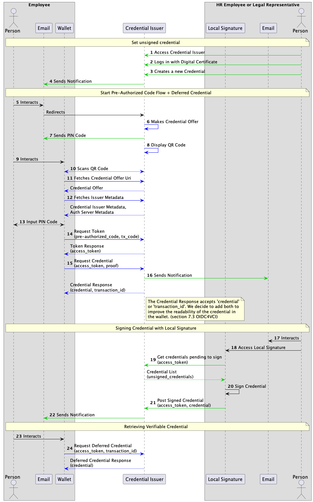
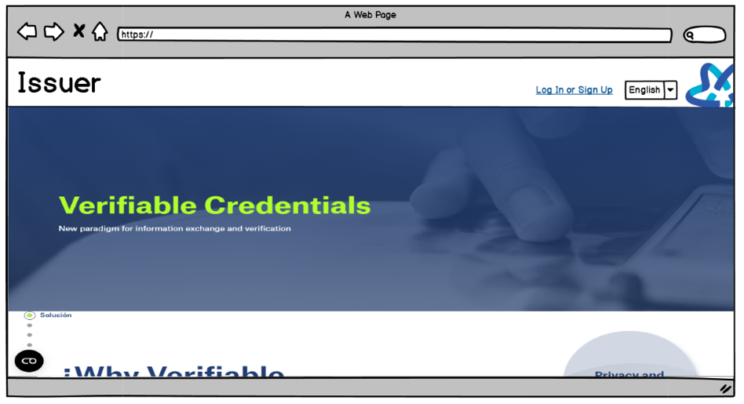
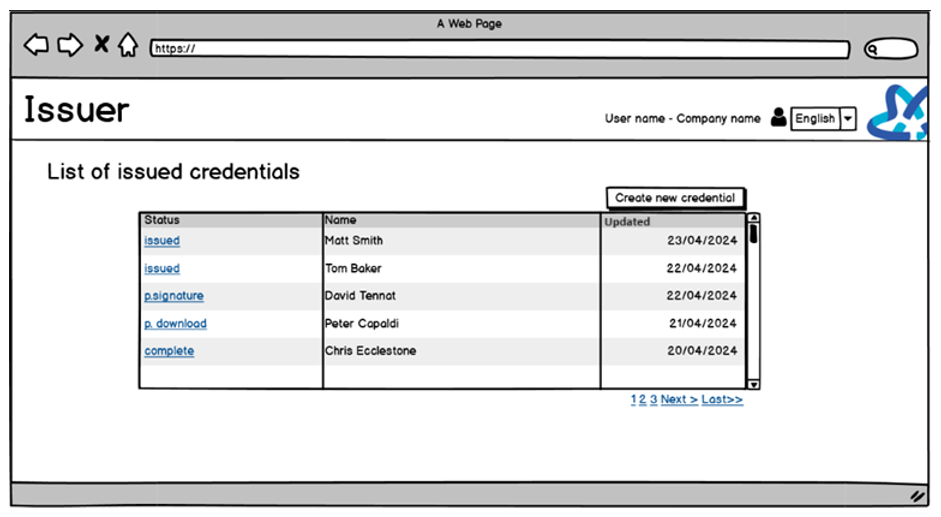
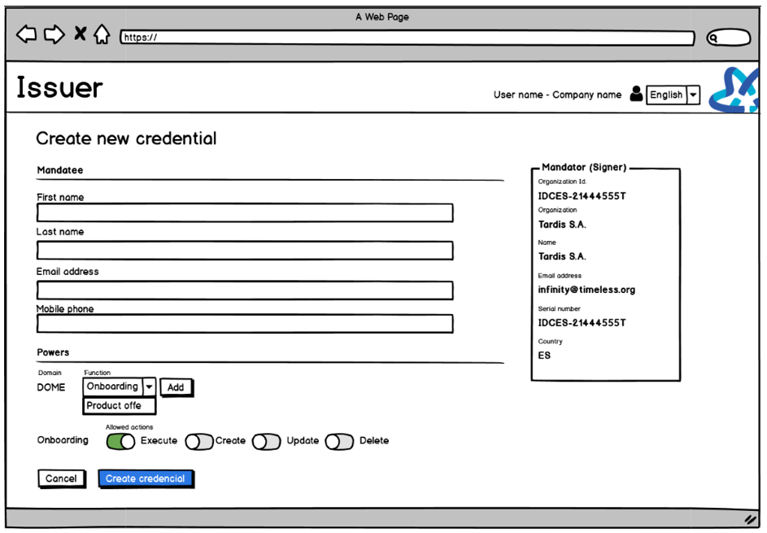
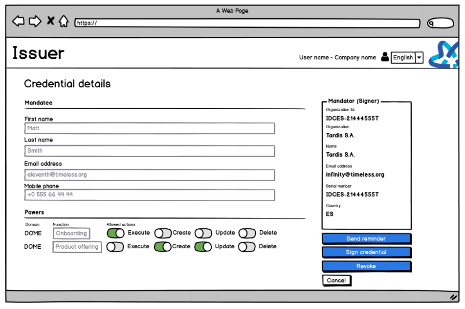
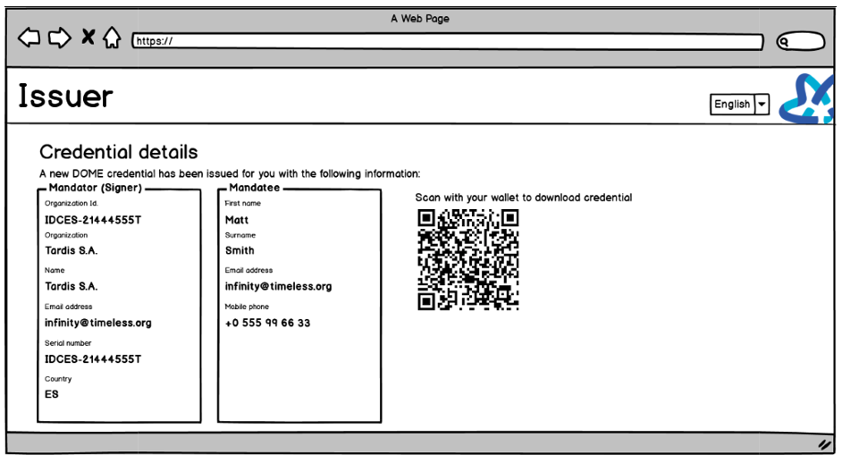
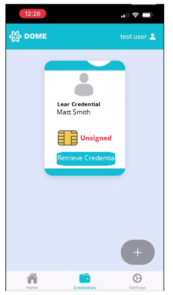
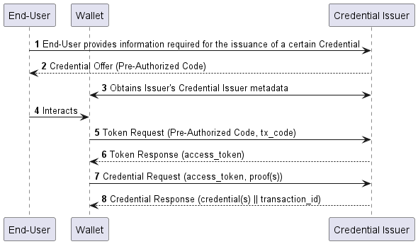

<h1>DOME Issuer Technical Documentation - Draft 1</h1>

<h2>Table of Contents</h2>

# Introduction

This document explains the technical specification for the DOME Issuer. The DOME Issuer is a real world implementation 
of two different technical specifications: the [OpenID for Verifiable Credential Issuance - DOME profile](https://dome-marketplace.github.io/OpenID4VCI-DOMEprofile/openid-4-verifiable-credential-issuance-wg-draft.html) and the [Authentication and authorization of entities acting on behalf of legal persons with Verifiable Credentials under eIDAS framework](https://dome-marketplace.github.io/powers-of-representation/index.html).

# CORE Concepts

The DOME Issuer implements the following core features from the technical specification documents. We know there are 
many possibilities to implement the Issuer, but we have decided the following features:

- Implements **Issuer Initiated** *(vs. Wallet Initiated)*.
- Implements **Pre-Authorized Code Flow** *(vs. Authorization Code Flow)*.
- Implements **Same-Device** and **Cross-Device** Credential Offer.
- Implements **Immediate** and **Deferred** Credential Issuance.

> JUSTIFICATION: The Credential Issuer only supports the Pre-Authorized Code Flow because the Credential Offer is 
> pre-created by the Human Resources department of the organization issuing the LEAR Credential to one of its employees.

> JUSTIFICATION: The flow will be Issuer initiated (using a QR code), because the organization offers the LEAR Credential 
> to an appointed employee after it has been decided after conversation between the HR department, the appointed employee 
> and the legal representative of the organization that has to sign the Credential.


# Flow Overview

The DOME Issuer implements the following flow for the issuance of a LEAR Credential to an employee of an organization:



1. The HR Employee or Legal Representative accesses the Credential Issuer Portal.
2. The HR Employee or Legal Representative logs in to the Credential Issuer Portal using their Digital Certificate.
3. The HR Employee or Legal Representative registers a new LEAR Credential for a specific Employee of their organization using a form.
4. The Credential Issuer notifies the Employee with the link needed to start the credential issuance process.
5. The Employee accesses the Credential Issuer executing the link attached in the received email.
6. The Credential Issuer makes a Credential Offer and updates the Credential Procedure.
7. The Credential Issuer sends the tx_code (PIN) to the Employee via email.
8. The Credential Issuer displays a QR code.
9. The Employee accesses the Wallet with their credentials.
10. The Employee scans the QR code with the Wallet.
11. The Wallet fetches the Credential Offer Uri.
12. The Wallet fetches the Credential Issuer's Metadata and the Authorization Server's Metadata.
13. The Employee interacts with the Wallet adding the tx_code received in the email.
14. The Wallet sends a Token Request to the Credential Issuer. The Token Request contains the Pre-Authorized Code obtained in the Credential Offer and the tx_code added by the Employee.
15. The Wallet sends a Credential Request to the Credential Issuer's Credential Endpoint. It contains the Access Token and the proof of possession of the private key of a key pair to which the Credential Issuer should bind the issued Credential to.
16. The Credential Issuer sends and emails to the HR Employee or Legal Representative to notify they have a new credential pending to be signed.
17. The HR Employee or Legal Representative reads the notification email. (out of scope)
18. The HR Employee or Legal Representative logs in to the Local Signature using their Digital Certificate. (out of scope)
19. The HR Employee or Legal Representative retrieves the pending credentials.
20. The HR Employee or Legal Representative selects one or more credentials to sign. (out of scope)
21. The Local Signature posts the signed credentials to the Credential Issuer.
22. The Credential Issuer sends an email to the Employee notifying that the Credential is ready to be retrieved.
23. The Employee reads the email and accesses the Wallet.
24. The Wallet retrieves the Credential using a Deferred Credential Request (access_token, transaction_id).

This is an overview of the flow. The following sections will explain in detail each step of the flow.

# Detailed Flow

## 1. The HR Employee or Legal Representative accesses the Credential Issuer Portal.

1. The HR Employee or Legal Representative accesses the Credential Issuer Portal using a web browser.
2. The Credential Issuer Portal shows the Home Page with the option to log in.
3. The HR Employee or Legal Representative clicks on the `Log in | Sing up` button.
4. The Credential Issuer redirects the HR Employee or Legal Representative to the Authorization Server.

## 2. The HR Employee or Legal Representative logs in to the Credential Issuer Portal using their Digital Certificate.

1. The Authorization Server request to the browser to attach a Digital Certificate which will be used to log in or sign up.
2. The HR Employee or Legal Representative selects a Digital Certificate from the browser.
3. The Authorization Server validates the Digital Certificate:
   1. If the Digital Certificate is valid and is associated with a valid registered user, the Authorization Server logs in and redirects the HR Employee or Legal Representative to the Credential Issuer Portal.
   2. If the Digital Certificate is not valid, the Authorization Server shows an error message to the HR Employee or Legal Representative.
   3. If the Digital Certificate is valid but is not associated with a valid registered user, the Authorization Server starts the registration process for the HR Employee or Legal Representative. The registration process must include the validation of the Digital Certificate and the verification of the HR Employee or Legal Representative's email address. 
      1. If the Digital Certificate does not include the email address, the Authorization Server must request the email address to the HR Employee or Legal Representative.
      2. If the email address is already registered, the Authorization Server must show an error message to the HR Employee or Legal Representative. 
      3. If the email address is verified, the Authorization Server updates the status of the user to a valid status.
      4. If the HR Employee or Legal Representative tries to log in but the email address is not verified, the Authorization Server must show an error message to the HR Employee or Legal Representative.
      5. If the HR Employee or Legal Representative tries to log in and the email address is verified, and the Digital Certificate is valid, the Authorization Server logs in and redirects the HR Employee or Legal Representative to the Credential Issuer Portal.

## 3. The HR Employee or Legal Representative registers a new LEAR Credential for a specific Employee of their organization using a form.

> NOTE: A non-normative example of the LEAR Credential Employee could be found in the [Data Model - LEAR Credential Employee](#lear-credential-employee) section.

1. The Credential Issuer shows a form to the HR Employee or Legal Representative to register a new LEAR Credential Employee. The data related to the `Mandator` (HR Employee or Legal Representative) is pre-filled using the data from the Digital Certificate.
2. The HR Employee or Legal Representative fills `Mandatee` section with the data of the Employee that will receive the LEAR Credential using the form.
3. The HR Employee or Legal Representative sets the powers of representation that the Employee will have, for now `Onboarding` and `Product Offering`, but many others could be added in the future.
   > NOTE: Not each LEAR Credential Employee needs to set all the powers of representation. The HR Employee or Legal Representative can set the powers of representation that the Employee will have and then, set the actions related to that power.
4. The HR Employee or Legal Representative clicks on the `Create Credential` button.
5. The Credential Issuer validates the data and creates a new LEAR Credential Employee. 
   > NOTE: This LEAR Credential Employee has the final format, but the Cryptographic Binding is not set and the credential is not signed yet.
6. The Credential Issuer creates a new `Credential Procedure` entity. The Credential Procedure is in the status `WITHDRAWN` and sets the attribute `credential_decoded` with the Credential received.
   > NOTE: The Credential Procedure is a way to manage the Credential Issuance process. It includes the Credential, the status of the Credential Issuance, and the organization identifier, etc. You can find more information about the Credential Procedure in the [Data Model - Credential Procedure](#credential-procedure) section.
7. The Credential Issuer creates a new `Deferred Credential Metadata`. It includes the Transaction Code, as `transaction_code`, and the id of the Credential Procedure, `procedure_id`. This Transaction Code is a nonce that will be used to bind the Credential Offer with the Credential Request and to create the URI that will be sent to the Employee via email.
   > NOTE: The Deferred Credential Metadata is a way to manage the metadata needed to manage the deferred process. It includes the Transaction Code, the Credential Procedure id, etc. You can find more information about the Deferred Credential Metadata in the [Data Model - Deferred Credential Metadata](#deferred-credential-metadata) section.
   
## 4. The Credential Issuer notifies the Employee with the link needed to start the credential issuance process.

1. When the Credential Issuer finishes the registration of the LEAR Credential Employee, it sends an email to the Employee with the link to start the credential issuance process. The link includes the Transaction Code as a query parameter. This is a non-normative example of the link that the Employee will receive:

   ```text
    https://issuer.dome-marketplace.eu/credentials?transaction_code=oaKazRN8I0IbtZ0C7JuMn5
   ```

   > NOTE: The Credential Issuer sends the email using an SMTP server. The email includes a template with the link to start the credential issuance process and short but descriptive documentation about the process that the employee will follow. The email is sent to the email address of the Employee that was set in the LEAR Credential Employee form.

## 5. The Employee accesses the Credential Issuer executing the link attached in the received email.

1. The Employee reads the email and clicks on the link to start the process of receiving the LEAR Credential.
2. The Employee is redirected to the **Credential Offer Page** in the Credential Issuer Portal.
   > NOTE: You can find a mockup of the Credential Offer Page in the [Credential Issuer: Credential Offer Page](#5-credential-issuer-credential-offer---public---front-back) section.
3. The Credential Issuer validates the `transaction_code` and retrieves the `Credential Procedure`.

## 6. The Credential Issuer makes a Credential Offer and updates the Deferred Credential Metadata.

1. The Credential Issuer makes a `Credential Offer`:
   1. The Credential Issuer fetches the Authorization Server to create a `pre-authorized_code`.
   2. The Credential Issuer creates a `tx_code`, which is a PIN that will be sent to the Employee via email.
2. The Credential Offer updates the `Deferred Credential Metadata`. The `pre-authorized_code` is added to the Credential Procedure as `auth_server_nonce` attribute.
   
## 7. The Credential Issuer sends the tx_code (PIN) to the Employee via email.

The `tx_code` created during the Credential Offer is sent to the Employee via email. We will use a template to send the email to the Employee.

## 8. The Credential Issuer displays a QR code.

1. The Credential Issuer builds a `Credential Offer Uri` ([section 4.1.3](https://dome-marketplace.github.io/OpenID4VCI-DOMEprofile/openid-4-verifiable-credential-issuance-wg-draft.html#name-sending-credential-offer-by-)). This URI is a link that points to the Credential Offer. This `credential_offer_uri` is displayed as a QR code.

   The Credential Offer Uri uses a `nonce` value to bind the Credential Offer with the Credential Offer Uri.

   The `nonce` is saved as a key value in memory cache, and the Credential Offer as the value. This is burnt after the Credential Offer is retrieved by executing the Credential Offer Uri by the Wallet.

   This is a non-normative example of the Credential Offer Uri:

   ```text
       credential_offer_uri=https%3A%2F%2Fserver%2Eexample%2Ecom%2F84dr684f51jfdbj
   ```

## 9. The Employee accesses the Wallet with their credentials.

1. The Employee opens the Wallet application on their device.
2. The Employee logs in to the Wallet using their credentials (username and password).

## 10. The Employee scans the QR code with the Wallet.

1. The Employee clicks on the button "Scan".
2. The camera of the device is activated.
3. The Employee scans the QR code displayed by the Credential Issuer.
4. The Wallet reads the QR code content, interprets that it is a Credential Offer Uri, and executes the Credential Offer Uri.

## 11. The Wallet fetches the Credential Offer Uri.

1. The Wallet fetches the Credential Offer executing tha parsed `credential_offer_uri`.

   This is a non-normative example of the Credential Offer Uri:
   
   ```curl
      GET /credential_offer/84dr684f51jfdbj HTTP/1.1
      Host: issuer.dome-marketplace.eu
      https://server.example.com/84dr684f51jfdbj
   ```
   ```curl
      HTTP/1.1 200 OK
      Content-Type: application/json
      Accept-Language: en;q=0.8
      {
         "credential_issuer": "https://credential-issuer.example.com",
         "credential_configuration_ids": [
            "UniversityDegree_LDP_VC"
         ],
         "grants": {
         "urn:ietf:params:oauth:grant-type:pre-authorized_code": {
            "pre-authorized_code": "adhjhdjajkdkhjhdj",
            "tx_code": {}
         }
      }
   }
   ```

> NOTE: The Credential Offer Response includes the header `Accept-Language` to indicate the language preferred for display. The language(s) in HTTP Accept-Language and Content-Language Headers MUST use the values defined in [RFC3066]. 

> JUSTIFICATION: We do not implement the `Accept-Language` header in the Wallet's Credential Issuer Metadata request.

## 12. The Wallet fetches the Credential Issuer's Metadata and the Authorization Server's Metadata.

1. The Wallet fetches the Credential Issuer's Metadata ([section 11.2](https://dome-marketplace.github.io/OpenID4VCI-DOMEprofile/openid-4-verifiable-credential-issuance-wg-draft.html#name-credential-issuer-metadata)) creating a dynamic URL using the parameter `credential_issuer` and concatenating the path `/.well-known/openid-credential-issuer`.

   > NOTE: The communication with the Issuer Metadata Endpoint MUST use TLS.
   
   > NOTE: The request MUST be an HTTP request using GET method and the URL SHOULD NOT contain any query parameters.
   
   > NOTE: The Credential Issuer MUST return a JSON document compliant with this specification using the application/json media type and the HTTP Status Code 200.
   
   > NOTE: The Credential Issuer Metadata response includes the header `Accept-Language` to indicate the language preferred for display. The language(s) in HTTP Accept-Language and Content-Language Headers MUST use the values defined in [RFC3066].
   
   > JUSTIFICATION: We do not implement the `Accept-Language` header in the Wallet's Credential Issuer Metadata request.
   
   ```curl
   GET /.well-known/openid-credential-issuer HTTP/1.1
   Host: issuer.dome-marketplace.eu
   Accept-Language: fr-ch, fr;q=0.9, en;q=0.8, de;q=0.7, *;q=0.5
   ```
   
   This is a non-normative example of the Credential Issuer Metadata:
   
   ```json
   {
      "credential_issuer": "https://credential-issuer.example.com",
      "authorization_servers": [ "https://server.example.com" ],
      "credential_endpoint": "https://credential-issuer.example.com",
      "batch_credential_endpoint": "https://credential-issuer.example.com/batch_credential",
      "deferred_credential_endpoint": "https://credential-issuer.example.com/deferred_credential",
      "credential_response_encryption": {
         "alg_values_supported" : [
            "ECDH-ES"
         ],
         "enc_values_supported" : [
            "A128GCM"
         ],
         "encryption_required": false
      },
      "display": [
         {
            "name": "Example University",
            "locale": "en-US"
         },
         {
            "name": "Example Université",
            "locale": "fr-FR"
         }
      ],
      "credential_configurations_supported": {
         "UniversityDegreeCredential": {
            "format": "jwt_vc_json",
            "scope": "UniversityDegree",
            "cryptographic_binding_methods_supported": [
               "did:example"
            ],
            "credential_signing_alg_values_supported": [
               "ES256"
            ],
            "credential_definition":{
               "type": [
                  "VerifiableCredential",
                  "UniversityDegreeCredential"
               ],
               "credentialSubject": {
                  "given_name": {
                     "display": [
                        {
                           "name": "Given Name",
                           "locale": "en-US"
                        }
                     ]
                  },
                  "family_name": {
                     "display": [
                        {
                           "name": "Surname",
                           "locale": "en-US"
                        }
                     ]
                  },
                  "degree": {},
                  "gpa": {
                     "display": [
                        {
                           "name": "GPA"
                        }
                     ]
                  }
               }
            },
            "proof_types_supported": {
               "jwt": {
                  "proof_signing_alg_values_supported": [
                     "ES256"
                  ]
               }
            },
            "display": [
               {
                  "name": "University Credential",
                  "locale": "en-US",
                  "logo": {
                     "url": "https://university.example.edu/public/logo.png",
                     "alt_text": "a square logo of a university"
                  },
                  "background_color": "#12107c",
                  "text_color": "#FFFFFF"
               }
            ]
         }
      }
   }
   ```

2. The Wallet fetches the Authorization Server's Metadata ([section 11.3](https://dome-marketplace.github.io/OpenID4VCI-DOMEprofile/openid-4-verifiable-credential-issuance-wg-draft.html#name-oauth-20-authorization-serv)) creating a dynamic URL using the parameter `credential_issuer` and concatenating the path `/.well-known/openid-configuration`.

   > NOTE: The Credential Issuer Metadata is offered by the Keycloak Plugin and the Authorization Server Metadata is offered by the Keycloak. Both are part of the same system.

## 13. The Employee interacts with the Wallet adding the tx_code received in the email.

Previously to start the Token Request, the Employee must add the `tx_code` received in the email to the Wallet. 

This is a security measure to ensure that the Employee is the one that has received the email and is the one that is interacting with the Wallet.

1. The Wallet shows a modal to the Employee to add the `tx_code`.
2. The Employee adds the `tx_code` to the Wallet.

## 14. The Wallet sends a Token Request to the Credential Issuer. The Token Request contains the Pre-Authorized Code obtained in the Credential Offer and the tx_code added by the Employee.

1. The Wallet sends a Token Request to the Credential Issuer's Token Endpoint, retrieved from the Authorization Server Metadata info. The Token Request contains the Pre-Authorized Code obtained in the Credential Offer and the tx_code added by the Employee.

```curl
POST /token HTTP/1.1
Host: issuer.dome-marketplace.eu
Content-Type: application/x-www-form-urlencoded

grant_type=urn:ietf:params:oauth:grant-type:pre-authorized_code
&pre-authorized_code=SplxlOBeZQQYbYS6WxSbIA
&tx_code=123456
```

2. The Credential Issuer validates the Token Request and sends the `Token Response` ([section 6.2](https://dome-marketplace.github.io/OpenID4VCI-DOMEprofile/openid-4-verifiable-credential-issuance-wg-draft.html#name-successful-token-response)) to the Wallet. 

This is a non-normative example of the `Successful Token Response` ([section 6.2](https://dome-marketplace.github.io/OpenID4VCI-DOMEprofile/openid-4-verifiable-credential-issuance-wg-draft.html#name-successful-token-response)):

```curl
HTTP/1.1 200 OK
Content-Type: application/json
Cache-Control: no-store

{
   "access_token": "eyJhbGciOiJSUzI1NiIsInR5cCI6Ikp..sHQ",
   "token_type": "bearer",
   "expires_in": 86400,
   "c_nonce": "tZignsnFbp",
   "c_nonce_expires_in": 86400,
   "authorization_details": [
      {
         "type": "openid_credential",
         "credential_configuration_id": "LEARCredentialEmployee",
         "credential_identifiers": [ 
            "", 
            "" 
         ]
      }
   ]
}
```
   
This is a non-normative example of the `Token Error Response` ([section 6.3](https://dome-marketplace.github.io/OpenID4VCI-DOMEprofile/openid-4-verifiable-credential-issuance-wg-draft.html#name-token-error-response)) with an error:

```curl
HTTP/1.1 400 Bad Request
Content-Type: application/json
Cache-Control: no-store

{
   "error": "invalid_request"
}
```

## 15. The Wallet sends a Credential Request to the Credential Issuer's Credential Endpoint. It contains the Access Token and the proof of possession of the private key of a key pair to which the Credential Issuer should bind the issued Credential to.

1. The Wallet generates a `Credential Resquest` ([section 7.2](https://dome-marketplace.github.io/OpenID4VCI-DOMEprofile/openid-4-verifiable-credential-issuance-wg-draft.html#name-credential-request)). To do that, the Wallet needs:


[//]: # (todo: add the detailed flow)
   1. The Wallet creates a did:key to the Employee. This means the creation of a key pair, generating a DID, and storing the private key in a secure enclave such as HashiCorp Vault. 
2. The Wallet creates a `proof` 
3. The Wallet sends a Credential Request to the Credential Issuer's Credential Endpoint with the Access Token and the proof. This proof is the proof of possession of the private key of a key pair to which the Credential Issuer should bind the issued Credential to.


## 16. The Credential Issuer sends and emails to the HR Employee or Legal Representative to notify they have a new credential pending to be signed.

1. The Credential Issuer sends an email to the HR Employee or Legal Representative to notify they have a new credential pending to be signed.

## 17. The HR Employee or Legal Representative reads the notification email. (out of scope)

## 18. The HR Employee or Legal Representative logs in to the Local Signature using their Digital Certificate. (out of scope)

## 19. The HR Employee or Legal Representative retrieves the pending credentials.

1. The Local Signature component gets the pending credentials from the Credential Issuer. This request requires attaching of an Authorization header with the Digital Certificate of the HR Employee or Legal Representative.

This is a non-normative example of the request:

[//]: # (todo: add the detailed flow)
```curl
GET /pending-credentials HTTP/1.1
Host: local-signature.dome-marketplace.eu
Authorization bearer access_token
```

The response is a list of pending credentials that the HR Employee or Legal Representative can sign.

This is a non-normative example of the response:

```curl
HTTP/1.1 200 OK
Content-Type: application/json
Cache-Control: no-store

{
   "credentials": [
      {
         "credential": {
           "id": "1f33e8dc-bd3b-4395-8061-ebc6be7d06dd",
           "type": [
             "VerifiableCredential",
             "LEARCredentialEmployee"
           ],
           "credentialSubject": {
             "mandate": {...},
               "mandatee": {...},
               "mandator": {...},
               "power": [{...}, {...}]
             }
           },
           "expirationDate": "2025-04-02 09:23:22.637345122 +0000 UTC",
           "issuanceDate": "2024-04-02 09:23:22.637345122 +0000 UTC",
           "issuer": "did:web:in2.es",
           "validFrom": "2024-04-02 09:23:22.637345122 +0000 UTC"
         }
      },
      {
         "credential": {...}
      }
   ]
}
```

## 20. The HR Employee or Legal Representative selects one or more credentials to sign. (out of scope)

## 21. The Local Signature posts the signed credentials to the Credential Issuer.

1. The Local Signature component signs the Credential and sends it back to the Credential Issuer. This request requires attaching of an Authorization header with the Digital Certificate of the HR Employee or Legal Representative.

This is a non-normative example of the request:

```curl
POST /credentials HTTP/1.1
Host: issuer.dome-marketplace.eu
Authorization bearer access_token
Content-Type: application/json

{
   "credentials": [
      {
         "credential": "eyJraWQiOiJkaWQ6ZXh...C_aZKPxgihac0aW9EkL1nOzM"
      },
      {
         "credential": "YXNkZnNhZGZkamZqZGFza23....29tZTIzMjMyMzIzMjMy"
      }
   ]
}
```

## 22. The Credential Issuer sends an email to the Employee notifying that the Credential is ready to be retrieved.

1. The Credential Issuer receives the signed Credentials from the Local Signature Component.
2. The Credential Issuer validates the Authorization header.
3. The Credential Issuer updates the `credential_encoded` of the Credential Procedure with the signed Credential and sets a new status of the Credential Issuance (VALID).
4. The Credential Issuer updates the `vc` attribute of the Deferred Credential Metadata with the signed Credential.
5. The Credential Issuer sends an email to the Employee notifying that the Credential is ready to be retrieved.

## 23. The Employee reads the email and accesses the Wallet.

## 24. The Wallet retrieves the Credential using a Deferred Credential Request (access_token, transaction_id).

1. The Employee clicks on the button `Retrieve Credential` of the representation of the credential *not signed* of their wallet. 
2. The Wallet sends a Deferred Credential Request to the Credential Issuer's Deferred Credential Endpoint with the Access Token and the Transaction ID.

3. The Credential Issuer validates the Access Token and the Transaction ID
   1. If the Access Token and the Transaction ID are valid, but the Credential is not ready, the Credential Issuer: 
      1. burns the Transaction ID
      2. generates a new Transaction ID
      3. persists the Transaction ID in memory
      4. updates the Deferred Transaction Metadata
      5. returns a Deferred Response with the new Transaction ID 
   2. If the Access Token and the Transaction ID are valid and the Credential is ready, the Credential Issuer:
      1. retrieves the Credential from the Credential Procedure
      2. returns a Deferred Response with the Credential

4. The Wallet receives the Deferred Response and retrieves the Credential and stores it in the Wallet.


# Data Model

## LEAR Credential Employee

This is a non-normative example of the LEAR Credential Employee:

```json
{
   "id": "1f33e8dc-bd3b-4395-8061-ebc6be7d06dd",
   "type": [
      "VerifiableCredential",
      "LEARCredentialEmployee"
   ],
   "credentialSubject": {
      "mandate": {
         "id": "4e3c02b8-5c57-4679-8aa5-502d62484af5",
         "life_span": {
            "end_date_time": "2025-04-02 09:23:22.637345122 +0000 UTC",
            "start_date_time": "2024-04-02 09:23:22.637345122 +0000 UTC"
         },
         "mandator": {
            "commonName": "IN2",
            "country": "ES",
            "emailAddress": "rrhh@in2.es",
            "organization": "IN2, Ingeniería de la Información, S.L.",
            "organizationIdentifier": "VATES-B60645900",
            "serialNumber": "B60645900"
         },
         "mandatee": {
            "id": "did:key:zDnaeei6HxVe7ibR3mZmXa9SZgWs8UBj1FiTuwEKwmnChdUAu",
            "email": "oriol.canades@in2.es",
            "first_name": "Oriol",
            "gender": "M",
            "last_name": "Canadés",
            "mobile_phone": "+34666336699"
         },
         "power": [
            {
               "id": "6b8f3137-a57a-46a5-97e7-1117a20142fb",
               "tmf_action": "Execute",
               "tmf_domain": "DOME",
               "tmf_function": "Onboarding",
               "tmf_type": "Domain"
            },
            {
               "id": "ad9b1509-60ea-47d4-9878-18b581d8e19b",
               "tmf_action": [
                  "Create",
                  "Update"
               ],
               "tmf_domain": "DOME",
               "tmf_function": "ProductOffering",
               "tmf_type": "Domain"
            }
         ]
      }
   },
   "expirationDate": "2025-04-02 09:23:22.637345122 +0000 UTC",
   "issuanceDate": "2024-04-02 09:23:22.637345122 +0000 UTC",
   "issuer": "did:web:in2.es",
   "validFrom": "2024-04-02 09:23:22.637345122 +0000 UTC"
}
```

## Credential Procedure

| Field                   | Type   | Required | Description                                         |
|-------------------------|--------|----------|-----------------------------------------------------|
| procedure_id            | UUID   | true     | The id of the Credential Procedure.                 |
| credential_id           | UUID   | true     | The id of the Credential.                           |
| credential_format       | String | true     | The format of the Credential.                       |
| credential_status       | String | true     | The status of the Credential.                       |
| credential_decoded      | JSON   | true     | The Credential in decoded format.                   |
| credential_encoded      | String | true     | The Credential in encoded format.                   |
| organization_identifier | String | true     | The identifier of the organization.                 |
| updated_at              | Date   | true     | The date when the Credential Procedure was updated. |


> NOTE: The `credential_status` can be one of the following values: `WITHDRAWN`, `ISSUED`, `VALID`, `REVOKED`, and `EXPIRED`.


## Deferred Credential Metadata

| Field             | Type   | Required | Description                                 |
|-------------------|--------|----------|---------------------------------------------|
| id                | UUID   | true     | The id of the Deferred Credential Metadata. |
| transaction_code  | String | true     | The Transaction Code.                       |
| auth_server_nonce | String | true     | The Pre-Authorized Code.                    |
| transaction_id    | String | true     | The id of the Transaction.                  |
| procedure_id      | UUID   | true     | The id of the Credential Procedure.         |
| vc                | String | true     | The Credential in encoded format.           |
| vc_format         | String | true     | The format of the Credential.               |

# Credential Issuer - SaaS

## 1. Credential Issuer: Home Page (landing page) - public - Front



## 2. Credential Issuer: Log in | Sign up - public - Front, Auth Server

## 3. Credential Issuer: Credential Management - private - Front, Back



## 4. Credential Issuer: Create Credential - private - Front, Back





## 5. Credential Issuer: Credential Offer - public - Front, Back



## 6. Credential Wallet: Credentials Page - private - Front, Back




2 Issuer: Log in | Sign up


El Credential Issuer UI redirecciona al usuario al frontal del Keycloak --> endpoint por determinar


1. The HR Employee or Legal Representative accesses the Credential Issuer Portal.
2. The HR Employee or Legal Representative logs in to the Credential Issuer Portal using their Digital Certificate.
3. The HR Employee or Legal Representative accesses the Credential Management page and clicks on "Create new credential".
4. The HR Employee or Legal Representative registers a new LEAR Credential for a specific Employee of their organization using a form.
5. The Credential Issuer generates a Transaction Code and binds it to the LEAR Credential through a Credential Procedure.
6. The Credential Issuer notifies the Employee with the link needed to start the Pre-Authorized Code Flow.
7. The Employee accesses the Credential Issuer executing the link attached in the received email.
8. The Credential Issuer makes a Credential Offer and updates the Credential Procedure. 
9. The Credential Issuer sends the tx_code to the Employee via email. 
10. The Credential Issuer makes a Credential Offer Uri which is displayed as a QR code. 
11. The Employee accesses the Wallet with their credentials and scans the QR code. 
12. The Wallet reads the QR code content, executes the Credential Offer Uri, and retrieves the Credential Offer. 
13. The Wallet fetches the Credential Issuer's metadata. 
14. The Wallet fetches the Authorization Server's metadata. 
15. The Wallet sends a Token Request to the Credential Issuer. Toke Request contains the Pre-Authorized Code obtained in the Credential Offer and the tx_code obtained in the email.
16. The Credential Issuer validates the Token Request and sends the Token Response to the Wallet.
17. The Wallet sends a Credential Request to the Credential Issuer's Credential Endpoint with the Access Token and the proof of possession of the private key of a key pair to which the Credential Issuer should bind the issued Credential to.
18. The Credential Issuer validates the Access Token and the proof of possession. 
19. The Credential Issuer updates the LEARCredentialEmployee with the DID of the Employee.
20. The Credential Issuer updates the Credential Procedure with the Credential and sets a new status of the Credential Issuance (ISSUED).
21. The Credential Issuer sends an email to the Employee with the information about the next steps to follow.
22. The Credential Issuer generates the Transaction ID and stores it in memory.
23. The Credential Issuer sends and emails to the HR Employee or Legal Representative to notify they have a new credential pending to be signed.
24. The Credential Issuer sends the Credential (unsigned) and the Transaction ID to the Wallet.
25. The Wallet stores the Credential and required data to retrieve it in the future (Access Token and Transaction ID).
26. The HR Employee or Legal Representative accesses the Local Signatory. (out of scope)
27. The HR Employee or Legal Representative logs in to the Local Signatory using their Digital Certificate. (out of scope)
28. The HR Employee or Legal Representative retrieves the pending credentials.
29. The HR Employee or Legal Representative selects one or more credentials to sign. (out of scope)
30. The Local Signatory signs the Credential and sends it back to the Credential Issuer. (out of scope)
31. The Credential Issuer updates the Credential Procedure with the signed Credential and sets a new status of the Credential Issuance (VALID).
32. The Credential Issuer sends an email to the Employee notifying that the Credential is ready to be retrieved.
33. The Employee accesses the Wallet and retrieves the Credential using a Credential Request (Access Token, Transaction ID).
34. The Credential Issuer validates the Access Token and the Transaction ID and sends the Verifiable Credential to the Wallet.
35. The Wallet stores the Verifiable Credential in the Wallet.


# DOME Profile


## Issuer

- Exposes Credential Endpoint (section 7)
- Exposes Deferred Credential Endpoint (section9)
- Mechanism to make a Credential Offer (section 4)
- Mechanism to publish Issuer Metadata

> NOTE: Batch Endpoint is not implemented in the DOME Profile

> NOTE: Deferred Credential Endpoint (Option) is implemented in DOME Profile (Required) because the LEAR Credential must be signed by the legal representative (a natural person) of the organization, and this requires the manual intervention of the legal representative to authorize the signature.

> NOTE: The Credential Offer Mechanism makes a Credential Offer, but exposes credential_offer_uri as a QR code that has to be scanned by the Wallet of the End-User. This solution permits reducing the size of the QR code.

> NOTE: Wallet Notification Mechanism is not implemented in the DOME Profile.

> NOTE: DOME Profile requires that the LEAR Credential must implement the cryptographic binding of the DID of the employee in the credential.

> NOTE: We only support issuance of a single Credential of a specific type (the LEAR Credential for a given employee) with a given Access Token.

> NOTE: The unique format supported for the Credential is JWT.

## Authorization Server

> NOTE: The reference implementation of the issuer for LEAR Credentials has only one Authorization Server, and in addition, it is implemented in the Credential Issuer.

> NOTE: We use the "Pre-Authorized Code" Grant Type. The reasons for this are:
>   - The claims in the LEAR Credential are essentially based on employee data coming from the HR database, and typically the issuance process is initiated by the company. The employee to act as LEAR is pre-selected and then credential offer is prepared in advance using that employee data. The employee is notified in advance via some off-line mechanism and also when the credential offer is ready. The employee then will request the actual issuance to her wallet using the mechanisms described in this document.
>   - With these considerations, the flows for issuance are simpler while maintaining the required level of security.
> 
> We do not use Client metadata, as we do not require the Issuer to know in advance the wallet that will be used in the process. The issuance process will use a QR code scanned by the wallet, so the Issuer does not use the credential_offer_endpoint of the wallet.
> 
> The LEAR Credential Issuer does not have to support the Authorization Endpoint because is uses the "Pre-Authorized Code" Grant Type.

# Credential Issuance - DOME Profile (Tech. Spec from OIDC4VCI Draft 13)

This document explains the technical specification for the Credential Issuance in the DOME Profile. The DOME Profile is a profile for the OIDC4VCI Draft 13 Protocol.

DOME Profile Technical Decisions:

- Implements Issuer Initiated
- Implements Pre-Authorized Code Flow
- Implements Same-Device or Cross-Device Credential Offer
- Implements Immediate and Deferred


## Credential Issuance - Pre-Authorized Code Flow

In this section, we want to expose the flow for the Credential Issuance using the Pre-Authorized Code Flow.

To understand the technical specification and how it could be implemented in the real world, we will use the following structure:

* **Protocol explanation**: is the explanation that is part of the DOME Profile original specification document.
* **Step**: The step that is how we implement the technical specification in the real world.
* **Justification**: The justification for the technical decision made by the DOME Profile to the real world.



> Protocol explanation: (1) The Credential Issuer successfully obtains consent and End-User data required for the issuance of a requested Credential from the End-User using an Issuer-specific business process.

1. The End-User accesses the Credential Issuer Portal. (DOME + LEAR) --> Landing Page

2. The End-User logs in to the Credential Issuer Portal. (DOME + LEAR)

3. The End-User accesses the Credential Management page and clicks on "Create New Credential" 

4. The End-User registers a new LEARCredentialEmployee (without cryptographic binding) for a specific Employee of their organization using a form. (LEAR)

5. The Credential Issuer generates a Transaction Code and binds to the LEARCredentialEmployee though a LearCredentialProcedure. (LEAR)

```json
{
  "LearnCredentialProcedure": {
    "id": "82ea95d1-4522-47bd-8e05-a1f699cab3a7",
    "transaction_code": "oaKazRN8I0IbtZ0C7JuMn5",
    "pre-auth_code": "",
    "lear_credential_employee_json": { },
    "status": "WITHDRAWN",
    "updated": "2021-09-01T12:00:00Z"
  }
}
```

5. The Credential Issuer notifies the Employee with the Credential Issuer URI needed to start the Pre-Authorized Code Flow. (LEAR)

https://issuer.dome-marketplace.eu/credentials?transaction_code=transaction_code

6. The Employee accesses the Credential Issuer executing the link attached in the received email. (LEAR)

> Protocol explanation: (2) The flow defined in this specification begins as the Credential Issuer generates a Credential Offer for certain Credential(s) and communicates it to the Wallet, for example, as a QR code or as a URI. The Credential Offer contains the Credential Issuer's URL, the information about the Credential(s) being offered, and the Pre-Authorized Code. This step is defined in Section 4.1.

7. The Credential Issuer makes a Credential Offer and persists in memory.

> NOTE: The Credential Offer 

````json
    {
       "credential_issuer": "https://issuer.dome-marketplace.eu",
       "credential_configuration_ids": [
          "LEARCredentialEmployee"
       ],
       "grants": {
          "urn:ietf:params:oauth:grant-type:pre-authorized_code": {
             "pre-authorized_code": "oaKazRN8I0IbtZ0C7JuMn5",
             "tx_code": {
                "length": 4,
                "input_mode": "numeric",
                "description": "Please provide the one-time code that was sent via e-mail"
             }
          }
       }
    }
````

> PROBLEM: ¿Cómo vinculamos la LEARCredentialEmployeeData+TransactionCode con la CredentialOffer?


5. The Credential Issuer creates a credential_offer_uri, which points to the Credential Offer made, and it is displayed as a QR code.


6. The End-User scans the QR code with the Wallet.


7. The Wallet reads the QR code content, executes the credential_offer_uri, and retrieves the Credential Offer.

> Protocol explanation: (3) The Wallet uses the Credential Issuer's URL to fetch its metadata, as described in Section 11.2. The Wallet needs the metadata to learn the Credential types and formats that the Credential Issuer supports, and to determine the Token Endpoint (at the OAuth 2.0 Authorization Server) as well as the Credential Endpoint required to start the request.

8. The Wallet fetches the Credential Issuer's metadata.
9. The Wallet fetched the Authorization Server's metadata.

> Protocol explanation: (5-6) The Wallet sends the Pre-Authorized Code obtained in Step (2) in the Token Request to the Token Endpoint. The Wallet will additionally send a Transaction Code provided by the End-User, if it was required by the Credential Issuer. This step is defined in Section 6.

> Protocol explanation: (7-8) This step is the same as Step (5) in the Authorization Code Flow. 
> It is important to note that anyone who possesses a valid Pre-Authorized Code, without further security measures, would be able to receive a VC from the Credential Issuer. Implementers MUST implement mitigations most suitable to the use case. 
> One such mechanism defined in this specification is the usage of Transaction Codes. The Credential Issuer indicates the usage of Transaction Codes in the Credential Offer and sends the Transaction Code to the End-User via a second channel different than the issuance flow. After the End-User provides the Transaction Code, the Wallet sends the Transaction Code within the Token Request, and the Authorization Server verifies the Transaction Code.
> (7-8) The Wallet sends a Credential Request to the Credential Issuer's Credential Endpoint with the Access Token and (optionally) the proof of possession of the private key of a key pair to which the Credential Issuer should bind the issued Credential to. Upon successfully validating Access Token and proof, the Credential Issuer returns a Credential in the Credential Response. This step is defined in Section 7.

