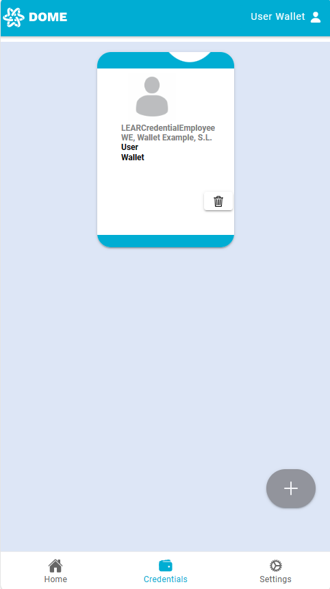
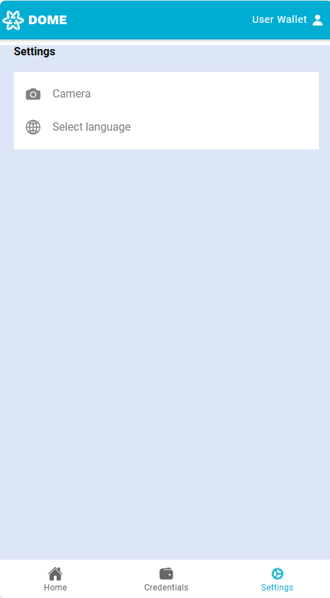
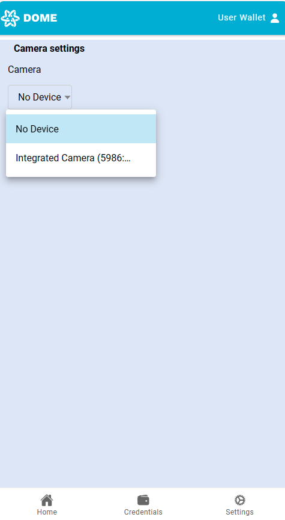

<html lang="en">
  <head>
    <!-- Style for the header, you can add your own CSS file or style tag here -->
    <title>wallet-guide-draft-1</title>
  </head>
  <body>
    

      

        <h1>IN2 Wallet Guide - Draft 1</h1>
        <table>
          <tr>
            <th>Workgroup:</th>
            <td>dome</td>
          </tr>
          <tr>
            <th>Published:</th>
            <td>21 February 2024</td>
          </tr>
          <tr>
            <th>Editor:</th>
            <td>
              <a href="mailto:oriol.canades@in2.es">Oriol Canadés</a>
            </td>
          </tr>
          <tr>
            <th>Authors:</th>
            <td>
              <a href="mailto:in2kizuna@gmail.com">IN2 Kizuna DevTeam</a>
            </td>
          </tr>
          <!-- Add more rows as needed -->
        </table>
      

    

  </body>
</html>

# Wallet Guide

Wallet Guide is a documentation which implements all the needed info to implement our wallet as a solution.

## Table of Contents
<!-- TOC -->
- [Wallet Guide](#wallet-guide)
  - [Table of Contents](#table-of-contents)
  - [Introduction](#introduction)
  - [Wallet](#wallet)
  - [Wallet API](#wallet-api)
  - [Wallet Demo](#wallet-demo)
  - [Wallet UI](#wallet-ui)
  - [Wallet Security](#wallet-security)
  - [Wallet Testing](#wallet-testing)
  - [Wallet Deployment](#wallet-deployment)
  - [Wallet Maintenance](#wallet-maintenance)
  - [Wallet Troubleshooting](#wallet-troubleshooting)
  - [Wallet FAQ](#wallet-faq)
  - [Wallet Glossary](#wallet-glossary)
<!-- /TOC -->

## Introduction

This guide is intended to provide a comprehensive overview of the IN2 Wallet and its components. It is designed to be a reference for developers, testers, and other stakeholders who are involved in the development, testing, deployment, and maintenance of the wallet.

## Wallet

The IN2 Wallet is a digital wallet that allows users to store, send, and receive digital assets such as verifiable credentials and presentations. It is designed to be a secure, user-friendly, and scalable solution that can be used by individuals, businesses, and other organizations.

The wallet enterprise solution id designed to be a modular and extensible platform that can be customized to meet the specific needs of different users and use cases. It is built on top of a set of open standards and protocols, and it is designed to be interoperable with other issuer and verifier solutions.

Our Wallet solution implements two principal components that can be integrated with other systems making it a versatile solution for different use cases. The current overview of the wallet components is as follows:

For now, we only support the following components:
* **IAM (Identity and Access Management)** 
  * Keycloak
* **Context Broker**
  * Orion-LD 
  * Scorpio 
  * Other NGSI-LD compliant context broker
* **Vault**
  * HashiCorp Vault
  * Azure Key Vault
* **Application Configuration**
  * YAML
  * Azure App Configuration

## Wallet DEMO

This section will guide you through the steps to access the Dome Marketplace using the VC Login option, utilizing a demo user account for demonstration purposes.

### Step 1: Access DOME Marketplace

Visit the Dome Marketplace by clicking on the following link: [DOME Marketplace](https://dome-marketplace.org).

### Step 2: Sign In

1. Click on the **Sign In** button.
2. Select **VC Login** from the options available.

A QR code will be displayed on the screen. This QR code is unique to your login session and should be scanned using the DOME Wallet app.

> **Note**: Do not attempt to scan the example QR code below, as it is only for demonstration purposes. Each QR code is unique and must be scanned during the current session to ensure security.

### Step 3: Log into DOME Wallet

1. Go to the DOME Wallet website: [DOME Wallet](https://dome-wallet.eu).
2. Log in using the demo user credentials:
   - Username: `userWallet`
   - Password: `userPass`

Upon logging in, navigate to the **Credentials** tab to view the VC that will be used for this demo.

### Step 4: Scan QR Code

Go back to the **Home** screen and press the **Scan QR** button to scan the QR code displayed on the Dome Marketplace login page.

### Step 5: Complete Attestation Exchange

After scanning the QR code, the Wallet and Verifier initiate the AttestationExchange process and in the wallet, you will be asked to select the credential you wish to present to enter the portal. In this example case, as we only have one, we will use that. Once selected, a pop-up will appear to confirm if we want to use that credential.

Upon successful completion, you will be redirected and logged into the marketplace.

The AttestationExchange process has concluded successfully, and you are now logged into the Dome Marketplace. You have full access to explore its functionalities and features available for demo users.

### Troubleshooting: Camera Not Activating for QR Scan

If the camera does not activate after pressing the **Scan QR** button, follow these steps:

#### Navigate to Settings

Within the DOME Wallet app, go to the **Settings** section.

#### Access Camera Settings

Find and select the **Camera** option to configure your camera settings.

#### Select Your Camera

Choose your preferred camera for QR scanning. If you have more than one camera, you may need to select which one to use.

#### Retry QR Scan

Return to the home screen and attempt to scan the QR code again.

By following these steps, you should be able to resolve the issue with the camera not activating for QR code scanning.

## Wallet API

This section will provide an overview of the wallet API and its components.

## Wallet UI

This section will provide an overview of the wallet UI and its components.

## Wallet Security

This section will provide an overview of the wallet security and its components.

## Wallet Testing

This section will provide an overview of the wallet testing and its components.

## Wallet Deployment

This section will provide an overview of the wallet deployment and its components.

### Docker Deployment

We have an IaC (Infrastructure as Code) repository that contains the necessary files to deploy the wallet solution using Docker. The repository is located at the following URL: https://github.com/in2workspace/in2-dome-iac/blob/main/wallet/test/README.md

### Kubernetes Deployment

We are currently working on a Kubernetes deployment guide for the wallet solution. You can check our Helm repository at the following URL: https://in2workspace.github.io/helm-charts/

## Wallet Maintenance

This section will provide an overview of the wallet maintenance and its components.

## Wallet Troubleshooting

This section will provide an overview of the wallet troubleshooting and its components.

## Wallet FAQ

This section will provide an overview of the wallet FAQ and its components.

## Wallet Glossary

This section will provide an overview of the wallet glossary and its components.

<!-- Contributors: Please do not add anything below this line -->

